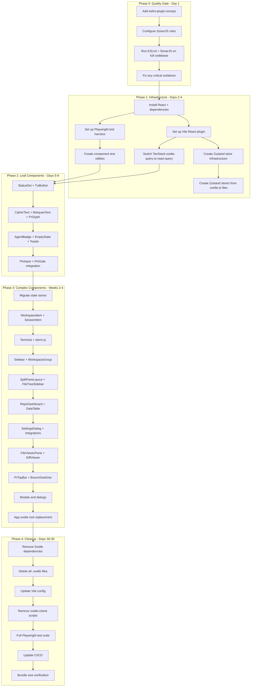

# Svelte 5 to React 19 Migration Plan

> **Status**: Ready for Execution
> **Created**: 2025-04-02
> **Estimated Duration**: 4-6 weeks
> **Strategy**: Incremental (Strangler Fig)

---

## Executive Summary

| Aspect | Current | Target |
|--------|---------|--------|
| Framework | Svelte 5.53.3 (runes) | React 19 |
| State | `.svelte.ts` runes | Zustand + TanStack Query |
| Components | 75 Svelte files | React TSX |
| Testing | 0 frontend tests | Playwright visual regression |
| ESLint | Strict config | Add SonarJS |
| Build | Vite + Svelte plugin | Vite + React plugin |

---

## Decisions Made

1. **Migration Strategy**: Incremental (strangler fig) — lower risk, ship continuously
2. **State Management**: Zustand for global client state, React Context for auth, TanStack Query for server state
3. **Router**: No router initially — keep current SPA architecture
4. **Component Order**: Feature-slice — start with PinGate + auth to verify infrastructure
5. **Quality Gate**: SonarJS first as pre-flight quality gate before migration
6. **Timeline**: 4-6 weeks acceptable

---

## Phase Overview

```
Phase 0: Quality Gate (Day 1)
    └── Add SonarJS, verify code quality baseline

Phase 1: Infrastructure (Days 2-4)
    └── Install React, set up Vite, create Zustand stores, Playwright harness

Phase 2: Leaf Components (Days 5-9)
    └── 10 leaf components + PinGate auth flow verification

Phase 3: Complex Components (Weeks 2-4)
    └── 15+ complex components independency order

Phase 4: Cleanup (Days 26-30)
    └── Remove Svelte, final tests, CI/CD update
```

---

## Parallel Task Graph



---

## Detailed Task Breakdown

### Phase 0: Quality Gate (Day 1)

#### P0.1: Add eslint-plugin-sonarjs

**Dependencies**: None
**Parallel**: No
**TDD Verification**: ESLint runs without errors
**Atomic Commit**: `chore: add eslint-plugin-sonarjs`

**Steps**:
1. Install: `npm install -D eslint-plugin-sonarjs`
2. Add to `eslint.config.js`:
   ```javascript
   import sonarjs from 'eslint-plugin-sonarjs';
   
   export default [
     // ... existing config ...
     sonarjs.configs.recommended,
     {
       rules: {
         'sonarjs/cognitive-complexity': ['error', 25],
         'sonarjs/no-duplicate-string': ['warn', { threshold: 4 }],
         'sonarjs/max-switch-cases': ['warn', 15],
         'sonarjs/no-identical-functions': 'warn',
         'sonarjs/no-duplicated-branches': 'warn',
       },
     },
   ];
   ```
3. Run: `npx eslint . --max-warnings=0`
4. Fix blocking errors
5. Commit

---

#### P0.2: Document Pre-Migration Baseline

**Dependencies**: P0.1 complete
**Parallel**: Yes
**TDD Verification**: Document exists
**Atomic Commit**: `docs: document pre-migration codebase metrics`

**Steps**:
1. Run: `npx eslint . --format json > eslint-baseline.json`
2. Count: `find frontend/src -name "*.svelte" | wc -l`
3. Measure: `npm run build && du -sh dist/frontend`
4. Create `docs/MIGRATION-BASELINE.md` with:
   - Component count: 75
   - Store modules: 8
   - Complexity metrics
   - Bundle size
   - Dependencies to remove/add

---

### Phase 1: Infrastructure (Days 2-4)

#### P1.1: Install React + Dependencies

**Dependencies**: P0 complete
**Parallel**: No
**TDD Verification**: `npm ls react` succeeds
**Atomic Commit**: `chore: add React 19 and Zustand dependencies`

```bash
npm install react react-dom zustand @tanstack/react-query
npm install -D @vitejs/plugin-react @types/react @types/react-dom
```

---

#### P1.2: Set Up Vite React Plugin

**Dependencies**: P1.1 complete
**Parallel**: No
**TDD Verification**: Vite dev server starts
**Atomic Commit**: `build: add Vite React plugin alongside Svelte`

Create `frontend/vite.config.react.ts`:
```typescript
import { defineConfig } from 'vite';
import react from '@vitejs/plugin-react';
import path from 'path';

export default defineConfig({
  plugins: [react()],
  resolve: {
    alias: { $lib: path.resolve(__dirname, './src/lib') },
  },
  build: { outDir: 'dist-react', sourcemap: true },
  server: {
    port: 3458,
    proxy: {
      '/auth': 'http://localhost:3000',
      '/sessions': 'http://localhost:3000',
      '/ws': { target: 'http://localhost:3000', ws: true },
    },
  },
});
```

Add script: `"dev:react": "vite --config frontend/vite.config.react.ts"`

---

#### P1.3: Create Zustand Store Infrastructure

**Dependencies**: P1.2 complete
**Parallel**: Yes (with P1.4)
**TDD Verification**: TypeScript compiles
**Atomic Commit**: `feat: create Zustand store infrastructure with devtools`

Create `frontend/src/lib/stores/index.ts`:
```typescript
import { devtools, persist } from 'zustand/middleware';
import { create } from 'zustand';

export const createStore = <T extends object>(
  name: string,
  initialState: T,
  persistConfig?: { storage?: 'localStorage' | 'sessionStorage' }
) => {
  // Implementation with devtools and optional persistence
};
```

---

#### P1.4: Migrate State Stores

**Dependencies**: P1.3 complete
**Parallel**: Yes (with P1.3)
**TDD Verification**: Each store compiles, types match
**Atomic Commit**: `feat: migrate all .svelte.ts stores to Zustand`

**Migration Order**:
| Store | Svelte File | React File | Priority | Complexity |
|-------|-------------|------------|----------|------------|
| auth | auth.svelte.ts | stores/auth.ts | 1 | Low |
| config | config.svelte.ts | stores/config.ts | 2 | Medium |
| ui | ui.svelte.ts | stores/ui.ts | 3 | Medium |
| sessions | sessions.svelte.ts | stores/sessions.ts | 4 | High |
| toasts | toasts.svelte.ts | stores/toasts.ts | 5 | Low |

**Pattern**:

```typescript
// BEFORE: Svelte 5
export const authState = $state({ authenticated: false, loading: true });

// AFTER: React + Zustand
export const useAuthStore = create<AuthState>()(
  devtools((set) => ({
    authenticated: false,
    loading: true,
    checkAuth: async () => {
      set({ loading: true });
      const response = await fetch('/auth/check');
      set({ authenticated: response.ok, loading: false });
    },
  }), { name: 'auth' })
);
```

---

#### P1.5: Switch TanStack Query

**Dependencies**: P1.1 complete
**Parallel**: Yes (with P1.3-P1.4)
**TDD Verification**: Query hooks compile
**Atomic Commit**: `feat: replace @tanstack/svelte-query with @tanstack/react-query`

```typescript
// frontend/src/lib/query-client.ts
import { QueryClient } from '@tanstack/react-query';

export const queryClient = new QueryClient({
  defaultOptions: {
    queries: {
      staleTime: 60 * 1000,
      gcTime: 5 * 60 * 1000,
      retry: 3,
      refetchOnWindowFocus: true,
    },
  },
});
```

---

#### P1.6: Set Up Playwright Test Harness

**Dependencies**: P0 complete
**Parallel**: Yes (with P1.3-P1.5)
**TDD Verification**: Playwright starts both servers
**Atomic Commit**: `test: set up Playwright test harness for visual regression`

Create `playwright.config.ts`:
```typescript
export default defineConfig({
  testDir: './tests/e2e',
  projects: [
    { name: 'svelte-baseline', use: { baseURL: 'http://localhost:3457' }},
    { name: 'react-migrated', use: { baseURL: 'http://localhost:3458' }},
  ],
  webServer: [
    { command: 'npm run dev:vite', url: 'http://localhost:3457' },
    { command: 'npm run dev:react', url: 'http://localhost:3458' },
  ],
});
```

Create test utilities in `tests/e2e/utils/visual-compare.ts`

---

#### P1.7: Create React Test App Shell

**Dependencies**: P1.2, P1.6 complete
**Parallel**: No
**TDD Verification**: React dev server renders
**Atomic Commit**: `feat: create minimal React app shell for testing`

Create structure:
```
frontend/src-react/
  ├── App.tsx
  ├── main.tsx
  ├── index.css
  └── lib/stores/ → symlink to ../lib/stores
```

---

### Phase 2: Leaf Components (Days 5-9)

Each component follows the TDD cycle:

1. **Write Playwright test** (baseline from Svelte)
2. **Create React component** (TSX file)
3. **Run visual comparison** (screenshots must match)
4. **Update imports** in dependent components
5. **Run ESLint + SonarJS**
6. **Commit atomically**

---

#### P2.1: StatusDot Component (Pattern Setter)

**Dependencies**: P1 complete
**Parallel**: No (first component, establishes pattern)
**TDD Verification**: Visual screenshots match
**Atomic Commit**: `migrate: StatusDot component to React`

**Tasks**:
1. Write test: `tests/e2e/components/StatusDot.pw.ts`
2. Create: `frontend/src-react/components/StatusDot.tsx`
3. Copy CSS from Svelte
4. Run: `npm run test:e2e -- --grep "StatusDot"`
5. Run: `npx eslint frontend/src-react/components/StatusDot.tsx`
6. Commit

---

#### P2.2-P2.8: Remaining Leaf Components

| Component | Dependencies | Parallel | Commit Message |
|-----------|-------------|----------|----------------|
| TuiButton | None | Yes (batch) | `migrate: TuiButton component to React` |
| CipherText | None | Yes | `migrate: CipherText component to React` |
| MarqueeText | None | Yes | `migrate: MarqueeText component to React` |
| PrGlyph | None | Yes | `migrate: PrGlyph component to React` |
| AgentBadge | None | Yes | `migrate: AgentBadge component to React` |
| EmptyState | None | Yes | `migrate: EmptyState component to React` |
| Toasts (3) | None | Yes | `migrate: Toast components to React` |

---

#### P2.9: PinInput + PinGate Integration

**Dependencies**: P2.8 complete
**Parallel**: No (critical auth flow)
**TDD Verification**: Full auth flow E2E
**Atomic Commit**: `migrate: PinInput and PinGate components to React`

**Milestone**: React app can authenticate, visual regression confirms UI match

---

### Phase 3: Complex Components (Weeks 2-4)

#### Migration Priority

| Week | Components | Days | Risk |
|------|------------|------|------|
| 2 | WorkspaceItem, SessionItem, WorkspaceGroup | 3 | Medium |
| 2-3 | Terminal (xterm.js) | 2 | High |
| 3 | Sidebar, SessionTabBar, SplitPaneLayout | 3 | Medium |
| 3-4 | FileTreeSidebar, FileViewerPane, DiffViewer | 3 | Medium |
| 4 | RepoDashboard, DataTable | 2 | Low |
| 4 | SettingsDialog + integrations | 2 | Medium |
| 4 | PrTopBar, BranchSwitcher | 2 | Low |
| 4 | Modals and dialogs | 2 | Low |
| 4 | App.svelte replacement | 1 | Low |

---

#### P3.1: WorkspaceItem Migration

**Dependencies**: P2 complete
**Parallel**: No (complex, establishes pattern)
**TDD Verification**: All session states render
**Atomic Commit**: `migrate: WorkspaceItem component to React`

**Pattern**:
```typescript
// BEFORE: Svelte
let sessions = $state<Session[]>([]);
$effect(() => { if (workspace.id) loadSessions(workspace.id); });

// AFTER: React
const [sessions, setSessions] = useState<Session[]>([]);
useEffect(() => {
  if (workspace.id) loadSessions(workspace.id);
}, [workspace.id]);
```

---

#### P3.2: Terminal (xterm.js Integration)

**Dependencies**: P3.1 complete
**Parallel**: No (critical component)
**TDD Verification**: WebSocket connects
**Atomic Commit**: `migrate: Terminal component with xterm.js to React`

**Pattern**:
```typescript
// BEFORE: Svelte
let container: HTMLElement;
$effect(() => {
  const term = new Terminal();
  term.open(container);
});

// AFTER: React
const containerRef = useRef<HTMLDivElement>(null);
const termRef = useRef<Terminal | null>(null);

useEffect(() => {
  if (containerRef.current && !termRef.current) {
    termRef.current = new Terminal();
    termRef.current.open(containerRef.current);
  }
  return () => { termRef.current?.dispose(); };
}, []);
```

---

#### P3.3-P3.10: Remaining Complex Components

Follow same TDD pattern for each.

---

### Phase 4: Cleanup (Days 26-30)

#### P4.1: Remove Svelte Dependencies

**Dependencies**: P3 complete
**Parallel**: No
**Atomic Commit**: `remove: Svelte 5 dependencies`

```bash
npm uninstall svelte @sveltejs/vite-plugin-svelte svelte-check svelte-dnd-action @tanstack/svelte-query
```

---

#### P4.2: Delete Svelte Files

**Dependencies**: P4.1 complete
**Parallel**: No
**Atomic Commit**: `remove: all Svelte component files`

```bash
find frontend/src -name "*.svelte" -delete
find frontend/src -name "*.svelte.ts" -delete
mv frontend/vite.config.react.ts frontend/vite.config.ts
```

---

#### P4.3: Update Build Configuration

**Dependencies**: P4.2 complete
**Parallel**: No
**Atomic Commit**: `build: remove Svelte from build pipeline`

Update `package.json`:
```json
{
  "scripts": {
    "check": "tsc --noEmit",
    "build": "tsc && vite build --config frontend/vite.config.ts"
  }
}
```

Remove `check:svelte` script.

---

#### P4.4: Final Test Suite Run

**Dependencies**: P4.3 complete
**Parallel**: No
**Atomic Commit**: `test: verify all E2E tests pass after migration`

```bash
npm run test
npm run test:e2e
npx eslint . --max-warnings=0
```

---

#### P4.5: CI/CD Update

**Dependencies**: P4.4 complete
**Parallel**: No
**Atomic Commit**: `ci: update workflows for React build`

Update `.github/workflows/test.yml` and `publish.yml`.

---

#### P4.6: Bundle Size Verification

**Dependencies**: P4.5 complete
**Parallel**: No
**Atomic Commit**: `docs: document post-migration bundle size`

Compare to baseline, update `docs/MIGRATION-BASELINE.md`.

---

## Atomic Commit Message Format

```
<type>(<scope>): <subject>

<body>

<footer>
```

**Types**: `feat`, `migrate`, `fix`, `refactor`, `test`, `docs`, `chore`, `remove`

**Examples**:
```
migrate: StatusDot component to React

- Convert StatusDot.svelte to StatusDot.tsx
- Add Playwright visual regression test
- Preserve all animations and states
- Run ESLint + SonarJS verification

Test: tests/e2e/components/StatusDot.pw.ts
Baseline: tests/screenshots/baseline/StatusDot/
```

---

## Verification Gates

| Phase | Gate Command | Pass Criteria |
|-------|-------------|---------------|
| P0 | `npx eslint . --max-warnings=0` | 0 errors |
| P1 | `npm run dev:react` | Server starts |
| P2 | `npm run test:e2e -- --grep "leaves"` | All pass |
| P3 | `npm run test:e2e -- --grep "complex"` | All pass |
| P4 | `npm run build && npm test && npm run test:e2e` | Full suite green |

---

## Rollback Plan

**Git Tag Strategy**:
```bash
git tag migration-P0-complete  # After SonarJS
git tag migration-P1-complete  # After infrastructure
git tag migration-P2-complete  # After leaf components
git tag migration-P3-complete  # After complex components
git tag migration-P4-complete  # After cleanup
```

If any phase fails critically:
1. Revert to previous tag
2. Investigate issue
3. Fix and re-attempt migration

---

## Svelte Runes → React Mapping Reference

| Svelte 5 Rune | React Equivalent | Notes |
|---------------|------------------|-------|
| `$state(x)` | `useState(x)` | React requires immutable updates |
| `$derived(x)` | `useMemo(() => x, [deps])` | Dependencies must be explicit |
| `$derived.by(() => x)` | `useMemo(() => x, [deps])` | Same as $derived |
| `$effect(() => {})` | `useEffect(() => {}, [deps])` | Cleanup via return function |
| `$props()` | `function Component({ ... })` | Destructure in params |
| `on:click={fn}` | `onClick={fn}` | No colon in React |

---

## Timeline Summary

| Week | Focus | Milestones |
|------|-------|------------|
| 1 | Quality Gate + Infrastructure | SonarJS, React set up, stores created |
| 2 | Leaf Components | 10 leaf components, PinGate works |
| 3 | Complex Components (Part 1) | Terminal, Sidebar, WorkspaceItem |
| 4 | Complex Components (Part 2) | All remaining components |
| 5 | Cleanup | Svelte removed, tests passing, CI green |

**Total Estimated Duration**: 4-6 weeks (20-30 days)

---

**Ready for execution. Begin with Phase 0, Task P0.1.**