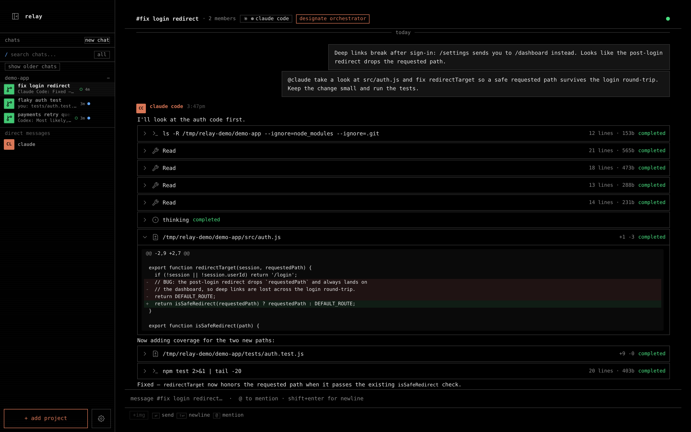
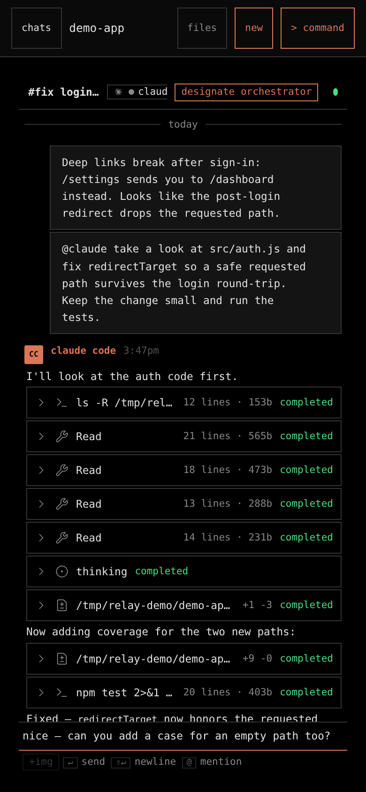
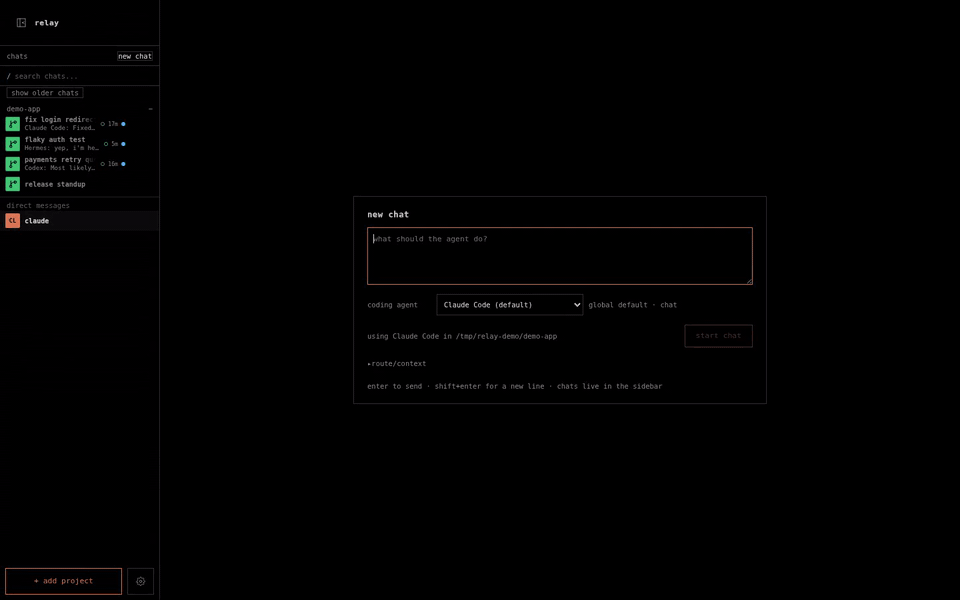

# relay-ide

Relay runs AI coding agents on your own machines and puts the conversation with
them in a browser you can open from anywhere. A channel is the durable
conversation, a DM is a channel with one agent profile, and agents post into the
timeline alongside you. Claude Code, Codex, OpenCode, Hermes, and custom
profiles all participate through the same contract.

The interface is channel-shaped because that shape is already familiar. The
product is not a chat platform. Relay is an execution workbench: every message
is anchored to a real node, working directory, and repository, and the terminal,
file, diff, and artifact surfaces sit next to the conversation instead of behind
an integration. Agents run as local processes on the machine you point them at,
so the work — checkouts, builds, git state — stays where it belongs, and you can
watch, interrupt, or take over from a phone. If you want a place for your team
to talk, use a team chat product. Relay is where the work runs. See
[`docs/WORKBENCH_BOUNDARY.md`](docs/WORKBENCH_BOUNDARY.md) for the full
boundary.

Relay is beta. It is dogfooded daily against its own repository, but the surface
still moves between releases and there is no upgrade-compatibility promise yet.

## Prerequisites

| Dependency                                             | Why                                                                                   |
| ------------------------------------------------------ | ------------------------------------------------------------------------------------- |
| [Node.js 24+](https://nodejs.org/)                     | Runtime and build target                                                              |
| Agent CLI such as Claude Code, Codex, OpenCode, Hermes | Relay launches configured frameworks as private channel runtimes from the node `PATH` |
| [GitHub CLI (`gh`)](https://cli.github.com/)           | Optional PR and CI integration                                                        |
| [Tailscale](https://tailscale.com/)                    | Recommended private phone/tablet access                                               |

## Quickstart

```bash
npm install -g relay-ide
relay-ide
```

1. **Open the hub.** Go to `http://localhost:3456`. Relay refuses browser
   traffic until a PIN is set. Foreground startup prompts in an interactive
   terminal; background startup can complete setup in the browser.
2. **Add a project.** The sidebar starts empty. Click `+ add project` at the
   bottom of the sidebar and point Relay at a directory on this machine. That
   directory becomes the working directory agents get.
3. **Start a chat.** Press `new chat`. You get an empty channel bound to that
   project.
4. **Mention an agent.** Type `@claude` or `@codex` and send. Relay starts (or
   reuses) that profile's private runtime on the node, hands it a bounded packet
   of the channel's own history, and mirrors the reply back into the same
   conversation. Reasoning, tool calls, code, output, and diffs arrive as
   collapsible cards on durable rows.
5. **Keep going.** Reply in the channel, or open a thread on a message to branch
   without losing the main timeline. Sending while an agent is mid-turn queues
   your message for its next turn; `cmd/ctrl`+`enter` interrupts the live turn
   and sends now.
6. **Manage profiles.** Settings → agent profiles configures provider, display
   name, model, reasoning effort, system prompt, environment variables, and who
   the profile responds to. The working directory comes from the channel's
   project, not the profile. `@claude` resolves to that vendor's _default_
   profile, not its only one — a second Claude profile with different settings
   is a separate participant with its own name.

A DM is the same thing with one participant: no mention needed, every message
routes to that profile.

When a new version is published you get an update toast in the corner; one click
updates the install and reloads.

## What it looks like



The same channel from a phone, with agent output and the composer in reach:



Agents are participants, not integrations — mention several in one channel and
they answer in parallel, each in its own runtime on the machine you pointed it
at:



The same clip as h264: [`docs/assets/agents-collab.mp4`](docs/assets/agents-collab.mp4).

## What is built

### Conversations

- Durable channels and DMs backed by SQLite conversation history.
- Human, agent, and system messages with Markdown, streaming updates, native
  image attachments, mentions, and threaded replies.
- Rich agent output in the live timeline: collapsible reasoning, tool, code,
  output, and diff cards with syntax highlighting.
- Mobile-ready channel navigation, agent status, approvals, interrupt controls,
  and terminal fallback.

### Messages

- Full-text search across channel history, with archived channels included when
  you turn on `show older chats`, two-section sidebar results, a command-palette
  category, and jump-to-message.
- Hover toolbar on any message: copy a `#msg-` deep link. On your own messages:
  edit or delete.
- Retry an agent reply that failed, was interrupted, or was truncated instead of
  retyping the prompt.
- Cross-device read-state sync. The hub persists your last-read marks and
  broadcasts moves, so a channel you read on your laptop is not unread on your
  phone.
- OS notifications, a favicon badge, and a title count while the tab is hidden.
- Mid-turn steering: queue for the agent's next turn, or interrupt and send now.

### Agents

- Agent profiles with built-in vendor profiles, per-profile configuration, a
  vendor gallery, availability state, and channel rosters.
- A Hermes agent profile can be bound to a named Hermes multiplex profile, with
  its own write-only gateway key, so a mention runs on that profile's own
  config, memory, and skills rather than the gateway default. See
  [`docs/references/hermes-multiplex-setup.md`](docs/references/hermes-multiplex-setup.md).
- Mention routing that starts or reuses the addressed profile's runtime,
  supplies bounded channel context, and mirrors the response into the same
  conversation.
- A persistent channel orchestrator that can route work to child agents; the
  spawned-agent lineage tree renders in the sidebar.

### Platform

- A hub/node execution model for local and paired machines.
- A versioned `relay-ide v1 ... --json` gateway for agent-operable actions.
- Terminal, file, diff, artifact, and evidence surfaces around the conversation.
- One-click self-update from the browser, plus `relay-ide update` on the host.

## Install and run

```bash
npm install -g relay-ide
relay-ide
```

Or install the background hub service:

```bash
relay-ide hub install
```

Reset the PIN from the host:

```bash
relay-ide pin reset
```

Do not expose Relay directly to the public internet. For another device, prefer
Tailscale and open `http://<tailscale-ip>:3456` from the same tailnet.

## Releases and updates

Relay publishes three npm dist-tags:

| Channel           | Install                            | Cut from                      |
| ----------------- | ---------------------------------- | ----------------------------- |
| Stable            | `npm install -g relay-ide`         | `vX.Y.Z` tag on `master`      |
| Release candidate | `npm install -g relay-ide@rc`      | `vX.Y.Z-rc.N` tag on `master` |
| Nightly           | `npm install -g relay-ide@nightly` | every push to `nightly`       |

A release candidate is a stable-shaped build soaking before it becomes the
default install; the stable lane refuses prerelease versions, so an rc can never
land on `@latest`.

`relay-ide update` updates this install in place and restarts the background
service if one is installed. It follows the `updateChannel` config field
(`stable` or `nightly`); install `@rc` explicitly with npm. The browser update
toast performs the same update and reloads when the server returns.

Release notes live in [`CHANGELOG.md`](CHANGELOG.md), which is the source of
truth for every tagged GitHub Release.

## Hub and nodes

Bare `relay-ide` and `relay-ide hub` run the hub. A node can pair with the hub,
publish a capability manifest, and hold a reverse node-link WebSocket:

```bash
relay-ide manifest
relay-ide node doctor --hub http://hub.example:3456
relay-ide node pair http://hub.example:3456
relay-ide node link --hub http://hub.example:3456
```

The hub owns browser auth, channels, routing, policy, and federated views. Each
node owns its local processes, filesystem paths, and repository checkouts.
Remote file browsing is available for online nodes; remote git actions remain
more limited than local repository actions.

## Configuration

Runtime data lives under the configured Relay config directory, not in the
source checkout:

- global: `~/.config/relay-ide/`
- source development: `~/.config/relay-ide/dev/<slug>-<hash>/`

The main config file is `config.json`. Common fields include `host`, `port`,
`cookieTTL`, `rootDirs`, `repos`, `workspaces`, `defaultFramework`,
`frameworks`, `updateChannel`, and optional GitHub integration settings.
Channel history and other durable stores live beside it.

## CLI

Run `relay-ide --help` for the exact installed command set. Main command
families:

```text
relay-ide                    run the hub
relay-ide hub ...            install, uninstall, status, logs, nodes, doctor, node-logs
relay-ide node ...           status, logs, doctor, pair, install, connect, link, update
relay-ide update             update this install from npm
relay-ide cockpit ...        read-first terminal cockpit; cockpit get <work-context-id>
relay-ide sessions ...       get, interventions, scoped list, scoped revoke
relay-ide v1 ... --json      stable agent-facing gateway
relay-ide manifest           print this node's capability manifest
relay-ide worktree ...       git worktree helper
relay-ide browser <path>     open an HTML artifact
relay-ide diag bundle ...    write a redacted diagnostics bundle
relay-ide audit verify ...   verify the security audit chain
relay-ide pin reset          reset browser authentication
```

## Source development

```bash
npm install
npm run dev
```

`npm run dev` builds the TypeScript backend, starts an isolated backend on
`127.0.0.1:3457`, and runs the Vite frontend on `127.0.0.1:5173`. Vite proxies
REST and WebSocket traffic to the backend.

Useful commands:

```bash
npm run dev:self
npm run dev:backend
npm run dev:vite
npm run check
npm test
npm run build
```

Use `npm run dev:self` when Relay is developing Relay so the child instance gets
isolated config, ports, and process identity. See
[`docs/SELF_HOSTING.md`](docs/SELF_HOSTING.md).

## Architecture

```text
browser
  ├─ ChannelView → ChannelTimeline → ChannelMessageRow
  ├─ ChannelComposer / ChannelThreadPanel / roster controls
  └─ terminal, file, diff, artifact, and settings surfaces
          │
          ▼
Relay hub
  ├─ channel router + durable message/attachment stores
  ├─ live channel fan-out + mention binder + agent bridge
  ├─ profile, roster, orchestration, auth, policy, and CLI gateway
  └─ local node + routed paired-node links
          │
          ▼
local and paired nodes
  └─ agent CLIs, relay-pty terminals, files, repos, worktrees
```

Start with [`docs/README.md`](docs/README.md), then read:

- [`docs/CHANNEL_CHAT.md`](docs/CHANNEL_CHAT.md) — conversation and agent model
- [`docs/ARCHITECTURE.md`](docs/ARCHITECTURE.md) — backend and protocol map
- [`docs/FRONTEND.md`](docs/FRONTEND.md) — live React surface map
- [`docs/WORKBENCH_BOUNDARY.md`](docs/WORKBENCH_BOUNDARY.md) — product boundary
- [`DESIGN.md`](DESIGN.md) — visual system
- [`docs/QUALITY.md`](docs/QUALITY.md) — tests and release gates

## Platform support

Linux and macOS are the primary host platforms. WSL2 nodes are supported with
documented limitations. Browser access works from desktop and mobile devices;
mobile behavior should be verified on the real target browser when changed.

## License

MIT
