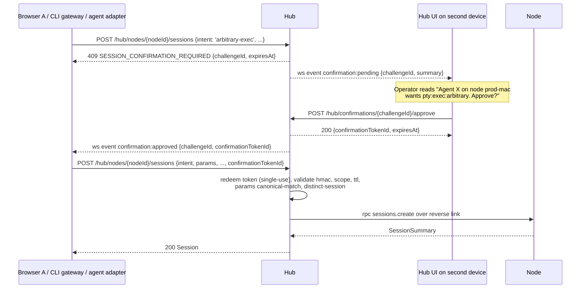

# Spike: Capability Bits, Credential Rotation, and Two-Token Confirmation

> **Status:** Spike complete — design gate, no runtime code
> **Scope:** Design the three security primitives that unblock the #427 security backbone
> **Date:** 2026-05-12
> **Issue:** [#422](https://github.com/donovan-yohan/relay-ide/issues/422)
> **Epic this unblocks:** [#427](https://github.com/donovan-yohan/relay-ide/issues/427)
> **Companion epic:** [#426](https://github.com/donovan-yohan/relay-ide/issues/426) (session intent + scope)
> **Normative ADRs:** [ADR-015](../adrs/ADR-015-core-primitives-domain-agnostic.md), [ADR-016](../adrs/ADR-016-node-to-node-isolation.md)

---

## tl;dr

**Recommendation: ship all three, in this order:**

1. **Capability bits** stored on a hub-side ACL keyed by `(nodeId, version)`, with the **credential carrying only an opaque `aclRef`** (`acl_v{n}_{ulid}`). The credential is a pointer; the policy lives where it can be rotated atomically without touching the node.
2. **Credential rotation** is a **hub-initiated, two-phase swap** delivered over the existing `/hub/node-link` reverse channel: hub issues the new credential as a `control.rotate-credential` envelope, node writes the new credential file atomically, node reconnects with the new token, hub revokes the old token only after the new link is established and acknowledged. Default 30-day rotation, configurable, manual rotation supported.
3. **Two-token confirmation** uses the **hub UI on a distinct authenticated session** (different session ID; same-session approval is forbidden as a hard rule) as the MVP channel — same protocol, separate authorization boundary, no new dependencies. The token is a `confirm_*` opaque value with `{scope, params, ttl, single-use, hmac}` shape, issued by the hub, redeemed at session-create time (#426 envelope), validated against the hub's policy registry. Tokens are bound to **the specific operation parameters the approver saw** (exact command string, file path, ref name, byte hash) — not just the intent type — so a token approved for `ls -la /tmp` cannot be used to execute `rm -rf /`.

This design respects ADR-016: confirmation tokens are issued and redeemed at the hub. Nodes never see, route, or validate confirmation tokens; they only see the resulting session grant. It respects ADR-015: capability bits and confirmation tokens are core security primitives. The mapping from a framework verb (e.g. "claude tool-use `Bash`") to a bit (e.g. `exec:arbitrary`) is feature-layer.

The follow-up implementation tickets are listed in §6 and are intended to be filed as sub-issues of #427.

---

## 1. Scope and non-goals

### In scope

- The schema and storage location for **capability bits**.
- The **rotation flow** (hub UI, CLI, and scheduled), including race conditions and state transitions.
- The **two-token confirmation flow**: token shape, channel, redemption, replay protection, offline fallback.
- The mapping from existing relay verbs to bits.
- Backward compatibility for existing pre-spike credentials.
- The threat model: what these mitigate and what they do not.
- Follow-up implementation tickets.

### Out of scope

- **Audit log.** Handled by #427 (security backbone epic) separately. This spike notes the hook points where audit entries are emitted but does not design the log itself.
- **Trust tiers (`sandbox` / `dev` / `prod`).** Handled by #427. This spike treats trust-tier-driven confirmation as an input to the policy engine, not part of this design.
- **Session-intent envelope.** Handled by #426. This spike assumes session create envelopes will carry `{intent, scope, ttl, confirmationTokenId?}` per that epic.
- **Hardware-key / WebAuthn / TOTP / push-to-phone confirmation channels.** Considered as alternates in §4; not the MVP. The architecture leaves a pluggable channel seam.
- **Multi-hub federation.** ADR-016 says the invariant applies at each hop if it ever ships; out of scope here.
- **The CLI gateway itself (#429).** This spike defines the gating primitives the gateway will call into.

---

## 2. Capability bits

### 2.1 Where the bits live

**Recommendation: hub-side ACL, referenced by an opaque `aclRef` on the credential.**

Three locations were considered:

| Location                                                        | Pros                                                                                                                                    | Cons                                                                                                                                                                                                                                              |
| --------------------------------------------------------------- | --------------------------------------------------------------------------------------------------------------------------------------- | ------------------------------------------------------------------------------------------------------------------------------------------------------------------------------------------------------------------------------------------------- |
| **On the credential** (bits inline in `RelayNodeCredential`)    | Single source of truth; node can refuse verbs locally.                                                                                  | Bits cannot change without re-issuing or rotating the credential. Node-local check duplicates hub-side check (which is where ADR-016 mandates enforcement anyway). Credential becomes large and feature-shaped (e.g. `rpc:fs-write:<path-glob>`). |
| **Hub-side ACL only** (credential is opaque)                    | Policy can change instantly without touching the node. Hub is already the enforcement point (ADR-016 §Invariant 2). One place to audit. | Hub must always be online to make a policy decision — which it already must be to route. Acceptable.                                                                                                                                              |
| **Both** (bits on credential as advisory, ACL as authoritative) | Defense in depth; node refuses bad verbs early.                                                                                         | Two truths to keep in sync. Skew is a security bug, not just a UX bug. Reject.                                                                                                                                                                    |

The hub is already the only place that can authorize a cross-node operation (ADR-016 §Invariant 2). The node-local check adds no security and creates a sync surface. Bits live on the hub.

The credential carries a single opaque `aclRef`. When a session is created or an RPC is invoked, the hub looks up the ACL by ref and decides. The ACL can be re-versioned without touching the node — node never sees the bits. This is the same shape as how OAuth scopes are dereferenced server-side, rather than self-contained in a JWT.

### 2.2 Schema delta

#### `RelayNodeCredential` (shared/relay-node-protocol.ts)

```ts
export interface RelayNodeCredential {
  protocol: RelayNodeLinkProtocol;
  protocolVersion: typeof RELAY_NODE_LINK_PROTOCOL_VERSION;
  nodeId: string;
  credentialId: string;
  token: string;
  issuedAt: string;
  // ─── new fields ────────────────────────────────────────────
  aclRef: string; // e.g. "acl_v1_01HXYZ..." — opaque to node, the only authorization handle
  aclVersion?: number; // ADVISORY ONLY. Informational counter for operator UIs and diagnostics. Hub never gates on this value.
  rotationPolicy?: {
    maxAgeMs: number; // 0 means "do not auto-rotate"
    rotateAfter: string; // ISO timestamp, hub-driven hint
  };
}
```

The node persists the credential file with these fields but treats `aclRef` and `aclVersion` as opaque. The node does not parse, enforce, or branch on them.

**`aclVersion` is advisory only.** The hub enforces the latest ACL by dereferencing `aclRef` against its own ACL store on every decision — it does not need the node to report a version number, and a missing/stale `aclVersion` on the node never blocks a decision. The field exists so operator UIs and diagnostics can display "node is holding `acl_v3`, current authoritative version is `acl_v5`" without re-fetching the ACL itself. Skew is observable but not authoritative; the authoritative state lives in the hub ACL store, and ACL changes do not require the node to be touched in order to take effect — they take effect on the next hub-side decision.

Concretely: an operator toggling a bit re-versions the ACL entry hub-side. The next session-create or RPC for that node uses the new ACL immediately. Rotation of the credential itself is only required when the operator explicitly wants the node's persisted `aclRef` to point at a new ACL identifier (e.g. they want the node's local diagnostic to reflect the new policy version), or for the unrelated hygiene/compromise reasons in §3.1.

#### Hub-side ACL store (new file: `<configDir>/hub-node-acl.json`, mode `0600`)

```ts
interface HubNodeAclEntry {
  aclRef: string; // primary key
  nodeId: string;
  version: number;
  bits: Record<CapabilityBit, BitGrant>;
  createdAt: string;
  supersededAt?: string; // set when a new version replaces this
  supersededBy?: string; // aclRef of the new version
}

type CapabilityBit =
  | 'pty:interactive'
  | 'pty:exec:arbitrary'
  | 'rpc:fs:read'
  | 'rpc:fs:write'
  | 'rpc:fs:delete'
  | 'rpc:git:read'
  | 'rpc:git:write'
  | 'rpc:manifest:read'
  | 'rpc:repo-inventory:read'
  | 'preview:port-forward'
  | 'session:create:agent'
  | 'session:create:shell';

type BitGrant =
  | { state: 'on' }
  | { state: 'off' }
  | { state: 'on'; requiresConfirmation: true; tier: 'low' | 'high' };
```

The verb-set is a closed enum versioned alongside the protocol. Adding a bit is a protocol-minor bump.

#### `StoredNodeRecord` (server/hub-node-registry.ts)

Add:

```ts
aclRef: string;
aclVersionApplied?: number; // ADVISORY: last version the node reported on hello/rotation, for operator UIs only
```

The registry persists which ACL the node currently holds in its credential file (`aclRef`). The hub _always_ enforces against the latest ACL entry it has for the node, looked up by `nodeId` and the current `acl_v*` head — the credential's `aclRef` value is not consulted at decision time. `aclVersionApplied` is recorded purely so the hub UI can show "node is holding policy version N, current version is M"; drift surfaces a soft "rotate to refresh node-side policy hint" affordance but does not block decisions or force rotation. See finding #1 in the review log.

### 2.3 Verbs → bits

| Operation                                          | Channel          | Bit gate                                   | Notes                                                                                               |
| -------------------------------------------------- | ---------------- | ------------------------------------------ | --------------------------------------------------------------------------------------------------- |
| Create interactive PTY session (shell)             | `rpc` then `pty` | `session:create:shell` + `pty:interactive` | Default-on.                                                                                         |
| Create agent PTY session (`claude`, `codex`, etc.) | `rpc` then `pty` | `session:create:agent` + `pty:interactive` | Default-on. Agent CLI identity is feature-layer; core just sees "agent intent" (ADR-015).           |
| Arbitrary `exec` outside an attached PTY session   | `rpc`            | `pty:exec:arbitrary`                       | Default-off. High-tier verb. Triggers confirmation if `requiresConfirmation`.                       |
| `rpc:fs.read(path)`                                | `rpc`            | `rpc:fs:read`                              | Default-on for paired nodes today (feature-layer #428 future).                                      |
| `rpc:fs.write(path, bytes)`                        | `rpc`            | `rpc:fs:write`                             | Default-off. High-tier verb.                                                                        |
| `rpc:fs.delete(path)`                              | `rpc`            | `rpc:fs:delete`                            | Default-off. High-tier verb.                                                                        |
| `rpc:git.status / log / diff`                      | `rpc`            | `rpc:git:read`                             | Default-on.                                                                                         |
| `rpc:git.commit / push / checkout`                 | `rpc`            | `rpc:git:write`                            | Default-off. High-tier verb on `prod`-tier nodes; default-on on `dev`. (Tier policy lives in #427.) |
| `rpc:manifest.refresh`                             | `rpc`            | `rpc:manifest:read`                        | Default-on.                                                                                         |
| `rpc:repo-inventory.list`                          | `rpc`            | `rpc:repo-inventory:read`                  | Default-on.                                                                                         |
| `preview` channel attach                           | `preview`        | `preview:port-forward`                     | Future; default-off until shipped.                                                                  |

Mapping rule (per ADR-015): the relay core sees only the bit. The translation from an agent's tool-call name (e.g. Claude tool `Bash`, Codex function `shell.exec`) to the bit is done by the feature layer (CLI gateway, agent adapter). The core never decides "this is a `Bash` call" — it only sees "this is a `pty:exec:arbitrary` request."

### 2.4 Backward compatibility

Existing credentials issued before this spike lack `aclRef` / `aclVersion`. Two options were considered:

| Option                                                                                                                                                                                                                                                                                                                                                                                                       | Verdict                                                                                             |
| ------------------------------------------------------------------------------------------------------------------------------------------------------------------------------------------------------------------------------------------------------------------------------------------------------------------------------------------------------------------------------------------------------------ | --------------------------------------------------------------------------------------------------- |
| **Force re-pair.** All existing nodes break until the operator re-pairs them.                                                                                                                                                                                                                                                                                                                                | Reject. The MVP fleet is one operator with N nodes; needless friction.                              |
| **Default-grant set on first heartbeat after upgrade.** Hub detects a credential with no `aclRef`, creates an `acl_v1` entry with the today-set of grants (`session:create:*` on, `pty:interactive` on, `rpc:git:read` on, `rpc:manifest:read` on, `rpc:repo-inventory:read` on, everything else off), assigns it to the node, and delivers it as a rotation-credential envelope on next link establishment. | **Accept.** Preserves current behavior, makes the new policy explicit, requires no operator action. |

The default-grant set is encoded in `server/hub-node-acl.ts` (new module) as `DEFAULT_LEGACY_ACL_BITS`. It is unit-tested against the verb table above. After this migration runs once per node, the legacy code path can be retired.

---

## 3. Credential rotation

### 3.1 Triggers

| Trigger                              | Surface                                                                                                                                                                                                                                                                                                                    | Notes                                                                                                                        |
| ------------------------------------ | -------------------------------------------------------------------------------------------------------------------------------------------------------------------------------------------------------------------------------------------------------------------------------------------------------------------------- | ---------------------------------------------------------------------------------------------------------------------------- |
| **Operator manual**                  | Hub UI: `Nodes → <node> → Rotate credential`. CLI: `relay-ide node rotate-credential <nodeId>` (run on the hub, not the node).                                                                                                                                                                                             | Operator-initiated; lands in audit log (#427).                                                                               |
| **Scheduled**                        | Hub-side scheduler. Default 30 days, settable per node in hub config. `rotationPolicy.maxAgeMs` on the credential is the hint to the node UI; the _authoritative_ schedule is hub-side.                                                                                                                                    | Operator can set `maxAgeMs = 0` to disable per node.                                                                         |
| **Policy-driven (optional refresh)** | When the ACL store changes for a node, the hub bumps the ACL version. No rotation is required for the change to take effect — the hub already enforces the new ACL on the next decision. Rotation here is an _optional_ housekeeping refresh so the node-side credential reflects the latest `aclVersion` for diagnostics. | Decoupled from policy enforcement (see §2.1, finding #1 in the review log). Rotation is no longer "mandatory on ACL change." |
| **Compromise response**              | Operator clicks `Revoke + rotate` in hub UI. Old credential revoked immediately, no grace; node must re-pair (because revocation is final per ADR-012).                                                                                                                                                                    | Same code path as today's revoke; distinguished only by intent.                                                              |

The CLI verb is _hub-side_, not node-side. The node never decides to rotate itself. ADR-016 says hub is the authorization plane, and that includes credential lifecycle.

### 3.2 State transitions

States are stored on `StoredNodeRecord` as a small state machine. Only one rotation per node is in-flight at a time; concurrent rotation requests are rejected with `ROTATION_IN_PROGRESS`.

```
       ┌──────────┐
       │  STABLE  │ ◄────────────────────────────────┐
       └────┬─────┘                                  │
            │ operator/sched/policy triggers rotate  │
            ▼                                        │
       ┌──────────┐                                  │
       │ ISSUING  │  hub generates newCredential,    │
       │          │  marks oldCredentialId,          │
       └────┬─────┘  writes both in registry         │
            │                                        │
            │ send control.rotate-credential         │
            │  over reverse link                     │
            ▼                                        │
       ┌──────────┐                                  │
       │ DELIVERED│  envelope ack'd by node          │
       └────┬─────┘                                  │
            │ node writes new credential file        │
            │ atomically; reconnects with new token  │
            ▼                                        │
       ┌──────────┐                                  │
       │  PROVED  │  hub sees fresh /hub/node-link   │
       │          │  authenticated with newToken     │
       └────┬─────┘                                  │
            │ hub revokes oldCredentialId,           │
            │ closes any link still using it         │
            ▼                                        │
       (back to STABLE, with newCredentialId         │
        as the only active credential) ──────────────┘
```

If anything fails in `ISSUING` or `DELIVERED`, the rotation aborts and the **old** credential remains the active one. The new credential is reaped from the registry. Operator sees a `rotation-failed` banner with the diagnostic.

### 3.3 Delivery channel

**Recommendation: deliver the new credential over the existing `/hub/node-link` reverse WebSocket, as a `control.rotate-credential` envelope.**

Three channels were considered:

| Channel                                                                                                                 | Pros                                                                                                                              | Cons                                                                                                                                                                                                   |
| ----------------------------------------------------------------------------------------------------------------------- | --------------------------------------------------------------------------------------------------------------------------------- | ------------------------------------------------------------------------------------------------------------------------------------------------------------------------------------------------------ |
| **Reverse link** (recommended)                                                                                          | Already authenticated, already encrypted at TLS layer. No new ports / no new auth surface. Atomic with respect to link lifecycle. | Requires the node to be online to rotate. Operator must wait for next reconnect for an offline node. **Accepted.**                                                                                     |
| **Out-of-band file copy** (operator pastes onto node)                                                                   | Works for an offline node.                                                                                                        | Adds an operator-error surface (wrong file, wrong mode bits). Reject.                                                                                                                                  |
| **Pair-token-style ephemeral exchange** (issue a one-time rotation token, node calls a new `/hub/rotate` REST endpoint) | Clean separation.                                                                                                                 | Adds a new attack surface for "I have an old credential, I'll burn my one-shot rotation to mint a fresh one before you revoke me." Same vector as pair-token replay, but at the rotation seam. Reject. |

The new envelope:

```ts
// control channel, hub → node
{
  channel: 'control',
  type: 'rotate-credential',
  requestId: '...',
  payload: {
    newCredential: RelayNodeCredential,   // full new shape from §2.2
    oldCredentialId: string,              // for the node's own audit/logs
    deadline: string,                     // ISO; abort & re-stable if not ack'd by then
  }
}

// control channel, node → hub
{
  channel: 'control',
  type: 'rotate-credential.ack',
  requestId: '...',
  payload: {
    writtenAt: string,                    // when node-credential.json was rewritten
  }
}
```

After ack, the node closes the current link with code `4011 ROTATION_RECONNECT` and reconnects using the new token. The hub observes the new authenticated link and moves the registry from `DELIVERED → PROVED → STABLE`, revoking the old credential.

### 3.4 Node-side atomic write

Node writes `node-credential.json` using the **same temp+rename pattern** the hub registry already uses:

```ts
const tmpPath = `${path}.${pid}.${ts}.tmp`;
fs.writeFileSync(tmpPath, JSON.stringify(newCredential), { mode: 0o600 });
fs.renameSync(tmpPath, path); // atomic on POSIX
```

If the node crashes mid-write, the rename is atomic: either the old file is intact (and reconnect uses old credential, rotation re-attempts on next link), or the new file is in place (and reconnect uses new credential, which the hub still considers authoritative because the new credential exists in the registry).

### 3.5 Race conditions

| Race                                                                                                      | Resolution                                                                                                                                                                                                                                                                                                                                                                                                                                                                                                                                                                                                                                                                                                                                                                                                                                                                                                                                                                                                                                              |
| --------------------------------------------------------------------------------------------------------- | ------------------------------------------------------------------------------------------------------------------------------------------------------------------------------------------------------------------------------------------------------------------------------------------------------------------------------------------------------------------------------------------------------------------------------------------------------------------------------------------------------------------------------------------------------------------------------------------------------------------------------------------------------------------------------------------------------------------------------------------------------------------------------------------------------------------------------------------------------------------------------------------------------------------------------------------------------------------------------------------------------------------------------------------------------- |
| **In-flight RPC on the old link** when rotation envelope arrives.                                         | Node completes the in-flight RPC, sends the rotation-credential.ack, then closes the link. Hub holds the rotation in `DELIVERED` until the new link arrives; any RPC envelopes that arrive on the _old_ link in that window are rejected with `LINK_ROTATING`.                                                                                                                                                                                                                                                                                                                                                                                                                                                                                                                                                                                                                                                                                                                                                                                          |
| **Active PTY stream on the old link** when rotation envelope arrives.                                     | _Current behavior (this spike, as shipped against the existing `HubNodeLinkManager`)_: when the reverse link closes, any attached browser PTY WebSocket is closed immediately with `LINK_LOST` and the browser must re-attach to the (still tmux-backed) session after reconnect. There is no hub-side buffer or replay. Rotation deliberately invokes this same close path. Buffer-and-resume across rotation is a desirable improvement but is **not** in this design — see follow-up ticket 12.                                                                                                                                                                                                                                                                                                                                                                                                                                                                                                                                                      |
| **Two concurrent operator rotate clicks.**                                                                | The second request gets `ROTATION_IN_PROGRESS` until the first reaches `STABLE` or aborts.                                                                                                                                                                                                                                                                                                                                                                                                                                                                                                                                                                                                                                                                                                                                                                                                                                                                                                                                                              |
| **Multiple live links** (a node has two `/hub/node-link` WebSockets open, e.g. during a flaky reconnect). | Today's behavior already kicks out the older link on a newer link arrival (code `1012`). Rotation uses this: the new link with the new credential supersedes the old one. The old credential is revoked only after the _new_ link authenticates.                                                                                                                                                                                                                                                                                                                                                                                                                                                                                                                                                                                                                                                                                                                                                                                                        |
| **Partial node-credential.json write.**                                                                   | Mitigated by atomic rename. See §3.4.                                                                                                                                                                                                                                                                                                                                                                                                                                                                                                                                                                                                                                                                                                                                                                                                                                                                                                                                                                                                                   |
| **Hub crashes in `ISSUING` (before envelope delivery confirmed).**                                        | On restart, the hub reads the rotation journal, sees a credential in `ISSUING` state with no delivery ack, and rolls it back: marks the new credential abandoned, leaves the old credential active and unrevoked. Operator sees `rotation-aborted-hub-restart` and can retry. Safe because the node has not yet been told to switch.                                                                                                                                                                                                                                                                                                                                                                                                                                                                                                                                                                                                                                                                                                                    |
| **Hub crashes in `DELIVERED` (after node ack'd write, before new link observed and `PROVED`).**           | Critical recovery case. The hub must **not** roll back here — the node may have already atomically committed the new credential to disk and discarded the old token. The state machine is persisted to the rotation journal (`<configDir>/hub-rotations.json`, atomic write, `0600`) on every transition. On restart, the hub reads the journal, finds the rotation in `DELIVERED`, and rehydrates a `DELIVERED` registry entry where _both_ old and new credentials remain accepted for authentication. When the node reconnects, the hub checks which credential it used: if `newCredentialId`, advance to `PROVED → STABLE` and revoke the old credential; if `oldCredentialId`, the node never wrote the new file (or wrote it and then rolled back), so the hub aborts forward and reverts to `STABLE` on the old credential and reaps the new one. Either way no auth failure occurs. The `DELIVERED` grace period has its own deadline (default 24 hours, configurable); past it the rotation is force-aborted and the operator must re-trigger. |
| **Node receives rotation envelope, writes file, but crashes before reconnecting with new credential.**    | New credential is on disk; old credential remains accepted in the hub (the hub is in `DELIVERED` and accepts both credentials per the row above). On node restart, the node reads `node-credential.json` (now the new credential), reconnects with the new token, hub observes it, advances `DELIVERED → PROVED → STABLE`. ✅                                                                                                                                                                                                                                                                                                                                                                                                                                                                                                                                                                                                                                                                                                                           |
| **Operator runs `node link` manually with a stale credential after rotation.**                            | Hub rejects with `UNAUTHORIZED`; operator must re-fetch credential or re-pair.                                                                                                                                                                                                                                                                                                                                                                                                                                                                                                                                                                                                                                                                                                                                                                                                                                                                                                                                                                          |

#### Rotation persistence and `DELIVERED`-survives-restart (recovery)

The rotation state machine is durable, not in-memory. Every transition (`STABLE → ISSUING → DELIVERED → PROVED → STABLE`) is journaled to `<configDir>/hub-rotations.json` before the corresponding side effect (envelope send, credential revocation) is performed. The journal entry holds:

```ts
interface HubRotationJournalEntry {
  nodeId: string;
  state: 'ISSUING' | 'DELIVERED' | 'PROVED';
  oldCredentialId: string;
  newCredentialId: string;
  newCredential: RelayNodeCredential; // hub keeps the full new credential so it can keep accepting it after restart
  enteredStateAt: string;
  deliveredDeadline?: string; // absolute deadline for completing DELIVERED → PROVED, default 24h after entering DELIVERED
  reason: 'manual' | 'scheduled' | 'policy-refresh' | 'compromise';
}
```

On hub start, the rotation journal is replayed before the registry begins accepting new node links:

- **`ISSUING` entries** are rolled back. The node was not told to switch; the hub aborts forward, marks the rotation `aborted-hub-restart`, and reaps `newCredentialId` from the registry. Old credential remains the only active one.
- **`DELIVERED` entries** are preserved. The hub rehydrates the registry into a "dual-accept" state where both `oldCredentialId` and `newCredentialId` are valid authentication keys for that node. The first reconnect resolves the rotation forward (if new token) or backward (if old token), as described in the race table above. This is the critical fix: rolling back `DELIVERED` on the hub side after the node has committed the new credential to disk would brick the next reconnect with `UNAUTHORIZED`. We do not do that. We accept a small dual-credential window on the hub side, bounded by `deliveredDeadline`.
- **`PROVED` entries** complete: the hub revokes `oldCredentialId`, transitions to `STABLE`, and clears the journal entry. (A crash here means the old credential might still be in the registry as active; the replay finishes the revoke step idempotently.)

This addresses the Gemini finding that the original §3.5 only covered `ISSUING` recovery and would have caused authentication failure if the hub crashed after `DELIVERED`.

### 3.6 Does rotation invalidate sessions?

**Recommendation: rotation does _not_ invalidate existing sessions issued under #426 — only the next link establishment.**

Reasoning: under the session-intent model (#426), sessions are independently revocable and have their own TTL. They are not bound to credential-id, they are bound to `peerIdentity + nodeId + intent + scope + expiresAt`. A rotation is a routine hygiene event, not a trust event. Invalidating sessions on every 30-day rotation would force every browser tab to re-attach for no security gain.

Two exceptions:

1. **Compromise-response rotation** (operator clicks "Revoke + rotate"). Revocation already kills sessions per #426. Rotation is the second step.
2. **ACL change** (independent of whether rotation also happens). If a bit was _removed_, the hub re-validates open sessions against the new ACL immediately — no rotation required, because the new ACL is already authoritative (see §2.1, finding #1). Sessions that no longer have all required bits are revoked; the browser sees a typed `SESSION_PERMISSION_REVOKED` error and is prompted to re-create. The optional credential-refresh rotation (§3.1, "Policy-driven (optional refresh)") is decoupled from this and is purely cosmetic.

### 3.7 Hub UI surface

- `Nodes → <node>` page gets a `Rotate credential` button + a "Next rotation: in 14 days" label. If `aclVersionApplied < currentAclVersion`, the page shows an informational note ("Node-side policy hint is `acl_v3`; current authoritative policy is `acl_v5`. Policy is already in effect; rotate to refresh the node's local diagnostic.") — this is not a warning, because policy is already enforced; it is purely a "your diagnostics will look stale until next rotation" note.
- Rotation in-flight shows a step indicator (`Issuing → Delivered → Proved → Stable`).
- A rotation history table per node, 30-entry ring buffer.

---

## 4. Two-token confirmation flow

### 4.1 When it triggers

The session-create path (per #426 epic) carries `{intent, scope}`. The hub-side policy gate consults the node's ACL entry:

- If every bit needed for `intent` is `{ state: 'on' }`, session is granted directly.
- If any required bit is `{ state: 'off' }`, session is rejected (`SESSION_INTENT_FORBIDDEN`).
- If any required bit is `{ state: 'on', requiresConfirmation: true }`, the hub returns `SESSION_CONFIRMATION_REQUIRED` with a `challengeId`. The caller (CLI gateway, browser) must obtain a `confirm_*` token and retry with it attached.

Trust-tier overlay (#427): tier-3 (`prod`) nodes default to `requiresConfirmation: true` for `pty:exec:arbitrary`, `rpc:fs:write`, `rpc:fs:delete`, `rpc:git:write`. Tier overlay applies via a policy function in the ACL evaluator; the bit grant carries the default, the tier can elevate but not relax.

### 4.2 Token shape

```ts
interface ConfirmationToken {
  tokenId: string; // 'confirm_' + base64url(24 bytes)
  scope: {
    challengeId: string; // ties this token to a specific challenge
    peerIdentity: string; // the hub-level requester (browser session, CLI gateway invocation, agent adapter)
    nodeId: string;
    intent: SessionIntent; // exactly one intent per token (#426 union)
    bits: CapabilityBit[]; // the high-tier bits being authorized
    // ─── parameter binding (finding #3, anti approval-switching) ───
    params: ConfirmationParams; // exact operation parameters (see below) — must match at redemption
    paramsCanonical: string; // canonical JSON of `params`, used for hmac input
    paramsHash: string; // SHA-256(paramsCanonical), surfaced in audit log
    sessionId?: string; // present when confirming an op on an existing session
  };
  issuedAt: string;
  expiresAt: string; // default issuedAt + 90 seconds
  singleUse: true; // always true; tokens are consumed on redemption
  hmac: string; // HMAC-SHA256(hubSecret, canonicalized scope including paramsCanonical + tokenId)
}

// Per-bit/per-intent parameter shape. The exact parameters that the approver SAW and APPROVED.
// At redemption the requested operation's parameters must canonicalize to the same paramsCanonical.
type ConfirmationParams =
  | {
      kind: 'pty:exec:arbitrary';
      command: string;
      cwd?: string;
      env?: Record<string, string>;
    }
  | { kind: 'rpc:fs:write'; path: string; bytesSha256: string } // hash binds the actual bytes
  | { kind: 'rpc:fs:delete'; path: string; recursive: boolean }
  | {
      kind: 'rpc:git:write';
      verb: 'commit' | 'push' | 'checkout' | 'reset' | 'merge';
      refSpec: string;
    }
  | {
      kind: 'session:create:agent';
      agent: string;
      argv: string[];
      cwd?: string;
    }
  | { kind: 'session:create:shell'; argv: string[]; cwd?: string };
```

**Anti-approval-switching binding (finding #3).** A token approved for `ls -la /tmp` must not be reusable to execute `rm -rf /`. The fix is to bind the token to the exact operation parameters the human approved, not just the abstract intent type. At redemption time the hub re-canonicalizes the parameters of the operation it is about to execute and compares them byte-for-byte to `paramsCanonical` from the token (see §4.4 step 4); a mismatch returns `CONFIRMATION_PARAM_MISMATCH` and the token is _not_ consumed (so it can still be denied/expired, but cannot be drained by repeated mismatch attempts — a separate per-token failed-redeem counter caps this at 5 before the token is invalidated).

Canonicalization rules: JCS-style (RFC 8785) — keys sorted, no whitespace, UTF-8 NFC, numbers in shortest decimal form. Anything that mutates the user-visible intent (command string, target path, ref name, recursive flag) is part of `params`. Anything purely cosmetic (display label, timing) is not. The approver UI in §4.6 surfaces every field of `params` verbatim so the operator approves what will actually run.

For large payloads (`rpc:fs:write`), the bytes themselves are not in the token; their SHA-256 is. At redemption the hub recomputes the hash of the bytes the requester is delivering and compares.

Storage: hub keeps the **hash** of `tokenId` plus the scope payload (including `paramsCanonical` and `paramsHash`) and `hmac` in an in-memory registry with a periodic disk persist (`<configDir>/hub-confirmation-tokens.json`, mode `0600`). Tokens expire fast (90s default) so the on-disk set stays small; expired tokens reaped on read.

Replay protection: `singleUse: true` is enforced by deleting the token on first successful redemption inside a transaction. A second redemption attempt returns `CONFIRMATION_ALREADY_USED`.

TTL: 90 seconds is long enough for a human tap on a phone but short enough that a stolen token is mostly inert. Configurable per deployment.

### 4.3 Channel — MVP choice

**Recommendation: a confirmation prompt rendered in the hub UI, displayed on any authenticated browser session whose session ID is distinct from the requester's session ID.** Same-session approval is forbidden — see §4.5 for the hard rule.

The flow:

1. Browser A (or CLI gateway, or agent adapter) calls session-create with a high-tier intent. Hub returns `SESSION_CONFIRMATION_REQUIRED` + `challengeId`.
2. Hub pushes a `confirmation:pending` event over its existing `/ws/events` channel to **every authenticated hub session**, including Browser A. The event payload is the human-readable summary: "Agent X on browser session Y wants to `exec` arbitrary commands on node `prod-mac`. Approve?"
3. The operator opens the hub UI on a different device (phone browser logged into the same hub) and taps `Approve` or `Deny`. The hub mints a `confirm_*` token bound to that challenge and returns it to the _initiating_ requester (Browser A).
4. Browser A retries the session-create call with `confirmationTokenId` attached. Hub validates, redeems the token, grants the session.

Why this is the right MVP:

- **Zero new dependencies.** No push service, no TOTP library, no HSM, no WebAuthn registration ceremony. The hub already serves an authenticated UI and a `/ws/events` WebSocket.
- **Already authenticated.** The second device is logged into the hub via the same PIN-cookie flow today (#004, ADR-004). The "second factor" is "the operator's phone is on the same private network and the operator is logged in there."
- **Visible.** The operator literally sees the verb, the node, and the requester. This is the strongest defense against prompt-injection-driven privilege escalation.
- **Pluggable.** The redemption surface is a function `validate(challengeId, tokenId) → ok`; swapping in WebAuthn or push-to-phone later is a channel-level change, not a protocol-level one.

#### Alternates considered

| Channel                                                                                                  | Verdict                        | Why                                                                                                                                                                                    |
| -------------------------------------------------------------------------------------------------------- | ------------------------------ | -------------------------------------------------------------------------------------------------------------------------------------------------------------------------------------- |
| **Push notification to phone (FCM/APNs)**                                                                | Defer.                         | Requires a push provider account, mobile app or PWA, certificate handling. The hub-UI-on-phone approach gets 90% of the ergonomics at 0% of the operational cost.                      |
| **Hardware key / WebAuthn**                                                                              | Defer to post-MVP, leave seam. | Strongest factor; but requires a per-operator registration flow and a device they always carry. Worth doing as a follow-up; not the floor.                                             |
| **TOTP (RFC 6238)**                                                                                      | Defer.                         | Cheap to implement but adds a setup ceremony and a "shared secret on the hub" failure mode. For one-operator-one-fleet, the UI-on-second-device flow is friendlier and more auditable. |
| **CLI confirmation on the node** (operator SSHes to the node and runs `relay-ide confirm <challengeId>`) | Reject.                        | Violates ADR-016: makes a node-side surface authoritative for hub-level authorization. Also operationally awful.                                                                       |

### 4.4 Redemption flow



Validation steps in `redeem(challengeId, tokenId, operation)`:

1. Token exists in the registry and is not expired.
2. The SHA-256 of the presented `tokenId` matches the stored `tokenId` hash, compared with a timing-safe comparison.
3. `hmac` recomputes from the canonicalized scope (including `paramsCanonical`) + tokenId.
4. **Token scope matches the redemption attempt.** Each of these is checked and any mismatch is rejection:
   - `peerIdentity` exact match.
   - `nodeId` exact match.
   - `intent` exact match (one intent per token).
   - `bits` exact set match.
   - `sessionId` exact match if either side has one.
   - **`paramsCanonical` exact byte match against the canonicalized parameters of `operation`** (per the canonicalization rules in §4.2). For `pty:exec:arbitrary` this means the command string, cwd, and env must match exactly; substituting `rm -rf /` for the approved `ls -la /tmp` fails here. For `rpc:fs:write`, the SHA-256 of the bytes being written must match `params.bytesSha256` — substituting different bytes for the same path fails here. For `rpc:fs:delete` the path and `recursive` flag must match. For `rpc:git:write` the verb and refSpec must match.
   - On `paramsCanonical` mismatch, the response is `CONFIRMATION_PARAM_MISMATCH` and the token is **not** consumed (so a legitimate retry with the correct params still works); a per-token failed-redeem counter increments and at 5 the token is invalidated and the audit event escalates.
5. **Same-session approval is forbidden.** If the `peerIdentity` that initiated the request equals the `approverIdentity` recorded on the challenge, redemption fails with `CONFIRMATION_SAME_SESSION_FORBIDDEN`. See §4.5 — this is a hard rule, not a soft preference.
6. Token has not already been redeemed (single-use). Atomically deleted on success.

A failed redemption emits an audit event (per #427) with the reason code, `paramsHash` (so audits can diff what was approved vs. what was attempted), and the failed-redeem counter value.

### 4.5 Offline / channel-unreachable fallback

The confirmation channel can be unreachable in a few ways:

| Failure                                            | Behavior                                                                                                                                                                                                                                                                                                                                                                                                                                                                                                                                                                          |
| -------------------------------------------------- | --------------------------------------------------------------------------------------------------------------------------------------------------------------------------------------------------------------------------------------------------------------------------------------------------------------------------------------------------------------------------------------------------------------------------------------------------------------------------------------------------------------------------------------------------------------------------------- |
| Operator's second device is asleep / off-network.  | The challenge sits in `pending` for its TTL (default 5 minutes for the challenge itself, regardless of the 90s token TTL). Operator can approve from any future hub-authenticated session **other than the requesting one**. If TTL elapses, challenge expires; requester gets `CONFIRMATION_TIMED_OUT` and must re-issue.                                                                                                                                                                                                                                                        |
| Operator has only one device.                      | **Same-session approval is forbidden.** The approving hub session ID must be distinct from the requesting hub session ID — this is a hard rule (see below), not a configurable softening. The operator either opens a second browser/tab/profile, logs into the hub in a private window, or uses a phone/another device on the network. The friction is the security property: a compromised browser session (XSS, malicious extension, hijacked agent in the page) cannot self-approve its own high-tier requests because it does not control any _other_ authenticated session. |
| Hub is unreachable.                                | Nothing works; no fallback needed. The hub is the single source of authority (ADR-016).                                                                                                                                                                                                                                                                                                                                                                                                                                                                                           |
| Network partition between hub and approver-device. | Approver device shows stale UI; approval cannot reach hub. Same as the previous case — challenge expires, retry.                                                                                                                                                                                                                                                                                                                                                                                                                                                                  |

#### Hard rule: distinct-session approval (finding #4)

The hub enforces the following at challenge-approval time and again at token-redemption time:

```
approverSessionId !== requesterSessionId
```

Both IDs are hub-issued opaque session identifiers (from the existing PIN-cookie authentication flow, ADR-004). The check is unconditional: same-device is allowed (a second browser tab in a private window has a distinct session ID), but same-session is not. An attempt by the requesting session to call `POST /hub/confirmations/{challengeId}/approve` returns `409 CONFIRMATION_SAME_SESSION_FORBIDDEN` and emits a security audit event with both IDs.

**Why this is a hard rule, not configurable.** The whole point of two-token confirmation is to require a second authorization boundary. If the same session that emitted the suspicious tool-call can also approve it, the design provides no defense against the realistic threat models:

- An XSS payload in the hub UI tab can drive both the request and the approval click.
- A malicious browser extension with content-script access to the hub origin can do the same.
- A compromised agent rendering in an embedded iframe can do the same.

Allowing same-session approval — even gated behind a "tier-3 disables it" toggle — leaves the door open to deployments that opt into the weaker path and inherit those bypasses. The MVP is two-token, and two-token requires two sessions. The trade-off is real (single-device-single-browser users have more friction; a private-window login is the cheapest mitigation), and the trade-off is the point.

A future hardware-key channel (§4.3 alternates) can satisfy this rule trivially: the WebAuthn ceremony itself constitutes a distinct authorization boundary, independent of any session ID. We leave the channel pluggable for exactly that path.

Explicitly rejected fallbacks:

- **"Fail open if no approver responds in 60s."** No. Failing open on a high-tier verb is a backdoor. The policy is that a high-tier verb requires confirmation; failure to confirm means failure to act.
- **Skip-confirmation toggle in node config.** No. Would let a compromised node downgrade its own gate. ACL is hub-side per §2.

### 4.6 The "agent tried to do X on prod node" prompt — UX sketch

```
┌──────────────────────────────────────────────────────────┐
│ relay confirmation                                       │
│                                                          │
│ agent claude                                             │
│ session  browser session 7f3e (chrome, mac, 1m ago)      │
│ node     prod-mac    [PROD]                              │
│ intent   exec arbitrary command                          │
│ bits     pty:exec:arbitrary                              │
│                                                          │
│ command  rm -rf /Users/donovan/old-build                 │
│                                                          │
│ this is a tier-3 (prod) operation. confirming will issue │
│ a one-time token valid for 90s.                          │
│                                                          │
│   [ approve ]    [ deny ]    [ deny + revoke session ]   │
└──────────────────────────────────────────────────────────┘
```

Notes:

- Shows the specific command/payload where the intent makes it observable (e.g. `arbitrary-exec` carries the command line in scope; `file-write` shows the path; `rpc:git:write` shows the branch operation). The feature-layer adapter is responsible for surfacing it on the envelope; the core just passes it through.
- `deny + revoke session` is a one-click "this was a prompt injection, kill the source" affordance. It revokes the session at the hub (per #426) before denying the challenge.
- Renders the trust tier as a coloured badge using `DESIGN.md` semantic colors. Reuses existing TUI lowercase styling.

---

## 5. Threats — mitigated and not

### 5.1 Mitigated

| Threat                                                             | How                                                                                                                                                                                                                                                                                                                             |
| ------------------------------------------------------------------ | ------------------------------------------------------------------------------------------------------------------------------------------------------------------------------------------------------------------------------------------------------------------------------------------------------------------------------- |
| **Compromised agent driving a paired node to do destructive ops.** | Capability bits force every destructive verb through an explicit `off` or `requiresConfirmation` gate. The agent cannot grant itself bits. Confirmation requires a human on a second authenticated surface.                                                                                                                     |
| **Stolen credential file from a node.**                            | The thief gets a paired-node credential, not blanket access. The credential's effective surface is whatever bits are `on`. Destructive verbs are gated. Rotation reduces the window. Per #426, sessions are independent — the credential alone does not grant a usable session, and session creation goes through the gate.     |
| **Prompt injection.**                                              | Same shape as compromised agent: the agent emits a tool-call, the gateway translates it to a verb, the verb hits the gate, the operator sees a prompt with the actual command. The injection cannot suppress the prompt.                                                                                                        |
| **Replay of a previously-approved high-tier operation.**           | `singleUse: true` + scope match (peer + node + intent + bits) + 90s TTL. A captured confirmation token is consumed on first use and cannot be re-redeemed.                                                                                                                                                                      |
| **Cross-node lateral movement.**                                   | Per ADR-016 invariant 2, confirmation tokens cannot route via peer nodes. The token is issued and redeemed entirely at the hub. A compromised node cannot route a confirmation request through another node.                                                                                                                    |
| **Stale policy on a node.**                                        | Not possible. Hub-side ACL is the only authoritative store and the hub dereferences it on every decision. The node never holds policy as truth — `aclVersion` on the credential is advisory only (see §2.1, finding #1 in the review log). Policy changes take effect on the next decision without needing any node-side write. |
| **Tampered envelope claiming a confirmation token.**               | Token format includes `hmac` validated by hub; redemption checks token-id existence in registry. Forged envelopes fail the registry lookup.                                                                                                                                                                                     |

### 5.2 Not mitigated (be honest)

| Threat                                                          | Why this design doesn't help                                                                                                                                                                                                                                                                                                        |
| --------------------------------------------------------------- | ----------------------------------------------------------------------------------------------------------------------------------------------------------------------------------------------------------------------------------------------------------------------------------------------------------------------------------- |
| **Compromised hub.**                                            | The hub is the policy decision point. If it is compromised, the attacker can grant any bit, issue any confirmation token, and forge any session. Mitigation is operational (run the hub on private infrastructure per §federated-relay.md `Security Model`), not in this design.                                                    |
| **Compromised approver device.**                                | If the attacker also controls the device running the approver hub UI session, they can approve their own prompts. Hardware-key / WebAuthn upgrades the bar for this, which is why §4.3 leaves the channel pluggable. MVP does not solve it.                                                                                         |
| **Hub operator coerced/social-engineered into approving.**      | No technical fix. UI surfaces the verb explicitly to maximize the chance the operator notices.                                                                                                                                                                                                                                      |
| **Privilege escalation inside an already-granted PTY session.** | A high-tier session that has been granted is, within its TTL, a usable channel. The session's scope (#426) is the bound. If the bound is too loose (e.g. an `interactive-shell` session covers any shell command), then a malicious agent within that session can do anything a shell user can. Tightening this is #426/#429's job. |
| **Hub-side ACL store corruption / tampering.**                  | File is `0600`, atomic-written, hash-versioned per entry. But a root-level attacker on the hub can rewrite it. Same root-level assumption as the rest of the hub model.                                                                                                                                                             |
| **Time-of-check / time-of-use after grant.**                    | A session granted for `pty:exec:arbitrary` is granted; the agent can still issue many `exec` calls within that session. Per-verb confirmation (i.e. confirm-every-command) was considered and rejected as unusably noisy; the granularity is at the session level.                                                                  |

---

## 6. Follow-up implementation tickets

These will be filed as sub-issues of #427 ("Security backbone") and form the executable plan that falls out of this spike. Each ticket is sized for a single belayer run.

1. **`feat(security): capability-bit ACL store + schema`**
   Add `server/hub-node-acl.ts` with `HubNodeAclEntry`, `CapabilityBit` enum, and the default-grant set. Persist to `<configDir>/hub-node-acl.json` (atomic write, `0600`). Migration: on first heartbeat after upgrade, mint `acl_v1` for nodes lacking `aclRef`. Tests cover schema, default-grant correctness, atomic write, migration.

2. **`feat(security): RelayNodeCredential aclRef + aclVersion fields`**
   Schema delta on `shared/relay-node-protocol.ts`, registry persistence on `server/hub-node-registry.ts`, node-side credential file parsing/writing in `bin/relay-ide.ts`. Tests cover serialization, opaque-passthrough behavior, version-skew detection.

3. **`feat(security): hub policy evaluator + session gate`**
   New `server/hub-policy.ts`. Function `evaluate(peer, node, intent, scope) → { granted: true } | { granted: false, reason } | { granted: 'requires-confirmation', challengeId, bits }`. Wired into the session-create path (depends on #426 epic delivering the session-create envelope). Tests cover the verb table from §2.3.

4. **`feat(security): confirmation challenge + token registry`**
   New `server/hub-confirmation.ts`. Mint `challenge_*`, accept `approve`/`deny`, mint `confirm_*` token on approve. Single-use, hmac-signed, TTL-bounded. Persist to `<configDir>/hub-confirmation-tokens.json`. Tests cover ttl expiry, single-use, hmac validation, scope-match enforcement, replay rejection.

5. **`feat(security): confirmation events on /ws/events`**
   Push `confirmation:pending`, `confirmation:approved`, `confirmation:denied`, `confirmation:expired` events on the existing browser event channel to every authenticated session. Tests cover broadcast scoping (auth required), redaction (no token in pending event).

6. **`feat(frontend): confirmation prompt component`**
   React 19 component using Zustand state + TanStack Query for the approve/deny calls. Renders the prompt sketched in §4.6. Respects `DESIGN.md`. Tests via vitest + react-testing-library; flow test against an in-process hub.

7. **`feat(security): credential rotation state machine`**
   Extend `HubNodeRegistry` with `STABLE | ISSUING | DELIVERED | PROVED` and the `rotateCredential(nodeId)` API. Implement the `control.rotate-credential` envelope and the node-side handler in `server/node-link-client.ts`. Tests cover the state transitions, abort on hub restart in `ISSUING`, atomic node-side write, race conditions from §3.5.

8. **`feat(security): scheduled rotation + per-node policy`**
   Add the hub-side scheduler reading `rotationPolicy.maxAgeMs`. Default 30 days, configurable. Tests cover scheduling, skipping offline nodes, idempotency.

9. **`feat(cli): relay-ide node rotate-credential <nodeId> (hub-side)`**
   Operator verb, hub-side only. Calls into the rotation state machine. Tests cover happy path and `ROTATION_IN_PROGRESS` collision.

10. **`feat(security): re-validate open sessions on ACL change`**
    When the ACL store changes for a node, walk open sessions (#426 registry) and revoke any whose intent no longer satisfies the new bits. Emit typed `SESSION_PERMISSION_REVOKED`. Tests cover toggling a bit and observing session revocation.

11. **`docs(federated-relay): update Security Model section`**
    Document capability bits, rotation, confirmation. Replace the "every paired node is fully trusted" line with the tiered + bit-gated model. Reference this spike and the implementation PRs.

12. **`feat(hub-node-link): PTY buffer-and-resume across reverse-link reconnect`** _(follow-up, not blocking)_
    The current `HubNodeLinkManager` closes any attached browser PTY WebSocket immediately when the reverse link drops, including during deliberate rotation. The session itself survives (tmux backs it) but the browser must re-attach. This ticket adds a short (~5s, tunable) hub-side byte buffer on the PTY edge and a `resume` semantics on re-attach so that across a rotation-driven link bounce the user does not see their stream tear down. Out of scope for the rotation spike itself; tracked as a UX improvement so rotation is unobtrusive. See §3.5 "active PTY stream" row.

The set covers the spike's three pillars. Tickets 1–6 deliver capability bits + confirmation; 7–9 deliver rotation; 10–11 cover policy sync and docs; 12 is a follow-up UX improvement that makes rotation invisible to active PTY users.

---

## 7. ADR compliance check

- **ADR-015 (core domain-agnostic).** Capability bits, rotation, and confirmation are core security primitives. They operate on opaque `nodeId`, `peerIdentity`, `intent`, and `bits`. They do not reference repo identity, framework registry, or workspace concepts. Verb-to-bit translation (e.g. "Claude tool `Bash` maps to `pty:exec:arbitrary`") is feature-layer. The CLI gateway (#429) and agent adapters perform the translation; the core enforces the bit. ✅
- **ADR-016 (no node-to-node).** Confirmation tokens are issued and redeemed at the hub. Nodes never receive, route, or validate confirmation tokens. Rotation envelopes target one node only via its own authenticated reverse link; nothing in the design lets node A request, deliver, or approve rotation or confirmation for node B. Hub-side fan-out for multi-node operations (e.g. "rotate everything") executes per-node legs independently with hub-level identity. ✅
- **ADR-012/013 (pair-token/credential lifecycle; capability manifest).** ADR-012 and ADR-013 are not yet committed as files under `docs/adrs/` — the only ADR files in the repo today are ADR-015 and ADR-016. The invariants those decisions encode (SHA-256-hashed pair-token storage with timing-safe comparison, terminal revocation; capability-_probe_ manifest distinct from policy bits) currently live in `docs/federated-relay.md`. This design aligns with those invariants as summarized there: rotation extends the credential lifecycle with a new state machine while preserving hashed storage, timing-safe comparison, and immediate-revoke as terminal; and capability _bits_ (what a node is allowed to do) remain orthogonal to the manifest's capability _probes_ (what a node can do, e.g. does tmux exist), living in separate files (`hub-node-acl.json` vs. the node-side manifest). When ADR-012 and ADR-013 are backfilled to `docs/adrs/`, this section should be revisited to cite them directly. ✅

---

## 8. Open questions deferred to implementation

- **`aclVersionApplied` propagation: resolved.** Send only on hello and on rotation `ack`. Do **not** include in steady-state heartbeats. This aligns with finding #1 (the value is advisory; the hub does not need a live skew signal to make decisions), and keeps the heartbeat payload lean. The previous draft contradicted itself by claiming heartbeat-carries-aclVersion in §2.2 and "hello + rotation only" here; this is now the single answer.
- **Where does the audit log live?** #427 epic decides. This spike emits structured audit events at every gate decision and at every rotation transition; the sink is TBD.
- **Wire-format of `scope.bits` in the confirmation token.** Array vs bitmask. Array is more readable and the cardinality is small (~12 bits); start with array.
- **Confirmation token issued to whom?** The _initiating_ requester (browser session, CLI gateway). Returned via the same `/ws/events` channel as the `confirmation:approved` event. The flow in §4.4 assumes browser-on-WS; CLI gateway and agent adapter cases will need their own callback contract — define in ticket 4.
- **Operator can pre-approve a verb for a session window?** ("Trust this agent for the next 10 minutes of `arbitrary-exec`.") Punted: would weaken single-use; revisit if confirmation fatigue is observed.

---

## See also

- [ADR-015](../adrs/ADR-015-core-primitives-domain-agnostic.md) — Core relay primitives are domain-agnostic
- [ADR-016](../adrs/ADR-016-node-to-node-isolation.md) — Node-to-node isolation invariant
- [federated-relay.md](../federated-relay.md) — Current pairing, credential, and revocation lifecycle
- [shared/relay-node-protocol.ts](../../shared/relay-node-protocol.ts) — Wire protocol and `RelayNodeCredential` shape
- [server/hub-node-registry.ts](../../server/hub-node-registry.ts) — Today's registry, pairing, revocation
- Issue [#422](https://github.com/donovan-yohan/relay-ide/issues/422) — This spike
- Issue [#426](https://github.com/donovan-yohan/relay-ide/issues/426) — Session intent + scope (companion epic)
- Issue [#427](https://github.com/donovan-yohan/relay-ide/issues/427) — Security backbone (epic this unblocks)
