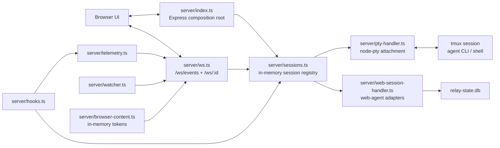
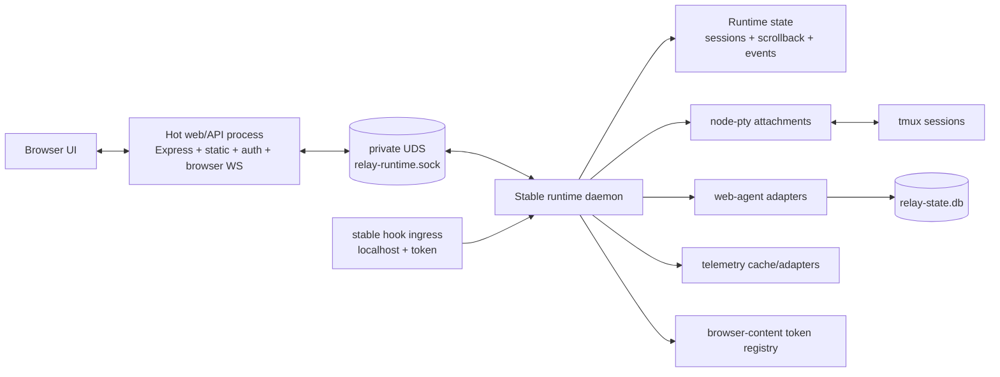

# Spike: Stable Runtime Daemon Design Gate

> **Status:** Spike complete — design gate, no runtime code  
> **Scope:** Split Relay's durable session runtime from the hot-swappable web/API surface  
> **Date:** 2026-05-08  
> **Issue:** [#364](https://github.com/donovan-yohan/relay-ide/issues/364)  
> **Epic:** [#368](https://github.com/donovan-yohan/relay-ide/issues/368)

---

## tl;dr

**Recommendation: proceed, but only after introducing an in-process runtime facade first.**

Relay already has the right durable substrate: tmux owns interactive process trees, `sessions.ts` can serialize PTY metadata/scrollback to `pending-sessions.json`, and web sessions are moving into `relay-state.db`. The unstable part is that `server/index.ts` still composes Express, browser WebSockets, session registry, node-pty attachments, hooks, telemetry, watchers, browser-content tokens, update/restart handling, and route wiring in one hot process.

The daemon split should put only session-runtime ownership behind a stable private process:

- PTY/web session registry and lifecycle
- node-pty attachments to tmux
- scrollback and session-state snapshots
- web-agent adapter runtimes and `relay-state.db`
- session event bus, hook ingestion, telemetry cache, and browser-content token registry

The hot web/API server should remain the browser-facing surface: auth cookies, static frontend, REST routers, GitHub/workspace dashboards, frontend WebSocket termination, and proxying to the daemon over a private local IPC channel.

**IPC choice: Unix-domain-socket HTTP + WebSocket.** Use request/response JSON for lifecycle APIs and a daemon WebSocket stream for PTY bytes/session events. Do not use stdio: it couples lifetimes to the supervisor. Do not expose another TCP port by default: it adds auth/firewall surface for no product value.

**First implementation PR:** add an in-process `RuntimeClient` / `RuntimeHost` facade and route existing session APIs + WebSocket attach logic through it without moving processes. That creates immediate value for #363/#366 by isolating restart/recovery seams and gives the daemon PR a narrow extraction target instead of a cursed rewrite.

---

## Current runtime shape

The important coupling is not tmux itself; tmux already survives. The coupling is that the browser-facing process also owns the live node-pty attachments, callback arrays, hook tokens, telemetry adapter instances, web-agent adapters, and browser-content token maps.

Relevant current touch points:

| Area             | Current owner                                                                           | Evidence / file-level touch point                           | Split implication                                                                                                    |
| ---------------- | --------------------------------------------------------------------------------------- | ----------------------------------------------------------- | -------------------------------------------------------------------------------------------------------------------- |
| Session registry | `sessions.ts` module-level `sessions = new Map<string, Session>()`                      | `server/sessions.ts`                                        | Move behind daemon-owned runtime API; web process should not mutate session objects directly.                        |
| PTY attachment   | `pty-handler.ts` spawns `node-pty`, attaches to tmux, keeps scrollback in memory        | `server/pty-handler.ts`                                     | Daemon owns node-pty and scrollback so hot web restarts do not reset attachment or lose in-memory scrollback deltas. |
| Browser PTY WS   | `ws.ts` terminates browser WS and directly subscribes to `session.pty.onData()`         | `server/ws.ts`                                              | Web keeps browser auth/WS, but proxies bytes to daemon stream.                                                       |
| Web sessions     | `web-session-handler.ts` creates `ProtocolAdapterV2`, persists via `relay-state-db.ts`  | `server/web-session-handler.ts`, `server/relay-state-db.ts` | Daemon owns live adapters and DB writes; web queries/proxies snapshots.                                              |
| Hooks            | `hooks.ts` localhost HTTP endpoints mutate session state and telemetry                  | `server/hooks.ts`                                           | Final split needs stable hook ingress into daemon, not the hot web process.                                          |
| Telemetry        | `telemetry.ts` has module-level maps, timers, adapter instances, pending telemetry file | `server/telemetry.ts`                                       | Daemon owns telemetry polling/cache; web exposes `/telemetry` by querying daemon.                                    |
| Watchers         | `watcher.ts` owns WorktreeWatcher, BranchWatcher, RefWatcher, GitWatcher                | `server/watcher.ts`, `server/index.ts`                      | Split into session-scoped daemon watchers vs dashboard/workspace web watchers; see watcher section.                  |
| Browser content  | `browser-content.ts` has process-local scoped token and per-file token maps             | `server/browser-content.ts`                                 | Tokens must survive hot web restart by living in daemon memory or durable local state.                               |
| Auth/static/API  | Express routes, cookie auth, static serving                                             | `server/index.ts`, `server/auth.ts`                         | Stays in hot web/API server.                                                                                         |

---

## Target architecture

### Minimal daemon responsibilities

The daemon should be boring and small. Its job is to preserve runtime continuity, not to become a second application server.

The daemon owns:

1. **Runtime identity**
   - session ids
   - session summaries
   - live state (`agentState`, `BackendDisplayState`, `idle`, `currentActivity`)
   - branch/display-name metadata that is attached to a session
2. **PTY runtime**
   - `node-pty` processes
   - tmux attach/spawn decisions
   - PTY writes/resizes
   - scrollback FIFO and disk checkpointing
   - PTY exit cleanup
3. **Web-agent runtime**
   - `ProtocolAdapterV2` instances
   - web session snapshots and patches
   - `relay-state.db` writes, flushes, restores, archive status
4. **Runtime event bus**
   - session created/ended
   - session backend state changed
   - PTY data stream availability
   - web-agent patch stream
   - session activity and telemetry events
5. **Stable agent ingress**
   - hook callbacks or a hook-forwarding protocol
   - per-session hook-token validation
   - branch-rename side effects that depend on session state
6. **Telemetry cache**
   - session telemetry adapters and polling timers
   - account telemetry snapshots
   - pending telemetry file if retained during migration
7. **Browser-content token registry**
   - long-lived scoped token used by `relay-ide browser`
   - per-file token -> baseDir/filePath mapping
   - token TTL cleanup

The daemon should not own:

- browser cookie auth, PIN setup, or static frontend serving
- GitHub OAuth, webhook setup, Smee lifecycle, org dashboard aggregation
- full workspace CRUD and settings UI
- production service installation/update commands
- frontend HMR or Vite serving
- arbitrary GitHub/Jira/Linear integration polling except when a session event needs to emit a ticket transition

Those can restart freely or can reconstruct state from config/GitHub/SQLite.

---

## IPC choice

### Recommendation

Use **Unix-domain-socket HTTP + WebSocket** for macOS/Linux:

- socket path: `${configDir}/runtime/relay-runtime.sock`
- mode: `0600`
- auth: random runtime token in `${configDir}/runtime/runtime-token` with `0600`, sent in the runtime bearer-token `Authorization` header from the web process
- API prefix: `/v1/...`
- request/response: JSON over HTTP
- streams: WebSocket over UDS for PTY bytes, web-agent patches, and event bus subscription

Example surface:

| Method / stream                            | Purpose                                                |
| ------------------------------------------ | ------------------------------------------------------ |
| `GET /v1/health`                           | daemon readiness, protocol version, config dir         |
| `GET /v1/sessions`                         | replacement for `sessions.list()`                      |
| `POST /v1/sessions/pty`                    | create PTY session                                     |
| `POST /v1/sessions/web`                    | create web session                                     |
| `PATCH /v1/sessions/:id`                   | rename/update display metadata                         |
| `DELETE /v1/sessions/:id`                  | kill/archive session                                   |
| `POST /v1/sessions/:id/input`              | PTY write or web-agent command                         |
| `POST /v1/sessions/:id/resize`             | PTY resize                                             |
| `GET /v1/sessions/:id/snapshot`            | PTY scrollback or web-agent snapshot                   |
| `WS /v1/sessions/:id/stream`               | PTY bytes or web-agent patches                         |
| `WS /v1/events`                            | session/backend-state/telemetry/browser-content events |
| `POST /v1/hooks/:sessionId/:event`         | hook forwarding if hot web remains ingress             |
| `POST /v1/browser-tabs`                    | create/reuse browser-content token                     |
| `GET /v1/browser-content/resolve/:token/*` | validate token and return resolved file path metadata  |

### Why not the alternatives

| Option                      | Verdict                | Reason                                                                                                                           |
| --------------------------- | ---------------------- | -------------------------------------------------------------------------------------------------------------------------------- |
| stdio child protocol        | reject                 | It couples daemon lifetime to the hot web process or supervisor and makes independent recovery awkward.                          |
| extra localhost TCP port    | avoid by default       | Easier to debug, but creates another port/auth/firewall surface and collision problem. Useful only as an opt-in debug transport. |
| gRPC                        | reject for now         | Adds codegen and HTTP/2 operational weight without a current cross-language need.                                                |
| SQLite-only command queue   | reject for primary IPC | Fine for snapshots, bad for PTY byte streams and low-latency input/resize.                                                       |
| direct browser -> daemon WS | reject                 | Browser auth, TLS/origin policy, and UI routing should remain in the web/API process. Keep daemon private.                       |

### Stream reconnect/catch-up protocol

Reconnect support is a required part of the daemon contract, not a later optional optimization. The daemon must make every browser-facing stream resumable across hot web/API restarts and transient browser disconnects.

**Sequence model:**

- The daemon assigns one monotonically increasing unsigned 64-bit `seq` per runtime event bus. The sequence space covers PTY output chunks, web-session patches, session lifecycle events, backend-state changes, telemetry deltas, and browser-content events.
- Each stream item also carries a stable `streamId` and type-local id:
  - PTY stream item: `{seq, streamId: "pty:<sessionId>", ptySeq, bytes}`
  - web-session patch: `{seq, streamId: "web:<sessionId>", patchSeq, patch}`
  - global event: `{seq, streamId: "events", eventSeq, event}`
- `seq`, `ptySeq`, `patchSeq`, and `eventSeq` are monotonic within a daemon run and never reset while the daemon process is alive. Daemon restart may reset in-memory sequence ids; clients must treat a changed daemon `epoch` from `/v1/health` as a non-resumable boundary and request fresh snapshots.
- Snapshot responses include the sequence boundary they are valid at: `GET /v1/sessions/:id/snapshot` returns `{epoch, snapshotSeq, kind, ...}`. All stream replay must start strictly after `snapshotSeq`.

**Replay window:**

- The daemon keeps an in-memory replay ring for every active session stream and for `/v1/events`.
- Minimum ring size: the larger of 256 KiB of PTY bytes/web patches per session or 30 seconds of stream items. The global event ring keeps at least 1,000 events or 30 seconds, whichever is larger.
- Rings are not durable across daemon restart. They are intended to cover hot web/API restarts and browser reconnects while the daemon remains alive.
- If `lastSeenSeq` is older than the oldest retained item, the daemon returns `409 replay_window_missed` for stream attach. The web process must fetch a fresh snapshot, clear/reconcile browser state for that session, and reopen the stream from the new `snapshotSeq`.

**Attach protocol:**

1. Browser reconnects to the hot web process with the last ids it rendered, either in WebSocket query params or the first client message: global `lastSeenSeq` plus per-stream `lastSeenPtySeq`, `lastSeenPatchSeq`, and `lastSeenEventSeq` when those streams were previously attached.
2. Web queries `/v1/health` and compares `epoch` + `protocolVersion`. Changed `epoch` or incompatible protocol version forces snapshot refresh instead of replay.
3. Web gets `GET /v1/sessions/:id/snapshot`, records `snapshotSeq`, and sends the snapshot to the browser before live bytes/patches.
4. Web opens `WS /v1/sessions/:id/stream?after=<snapshotSeq or client lastSeenSeq>` and `WS /v1/events?after=<lastSeenSeq>`. The daemon first replays retained items with `seq > after`, then switches to live fanout on the same socket.
5. Browser acks/render-tracks the highest contiguous id per stream. The client may receive duplicates when a web process restarts between daemon replay and browser render; duplicates are dropped by id. Gaps are never silently skipped: a missing id or daemon `replay_window_missed` forces a fresh snapshot.

**Duplicate/drop semantics:**

- Daemon never intentionally emits two different payloads with the same `(epoch, streamId, type-local id)`.
- Browser/web clients must make delivery idempotent by ignoring any PTY chunk, web patch, or event with an id less than or equal to the highest contiguous id already applied for that stream.
- If an item arrives with an id greater than `lastSeen + 1`, the client treats it as a gap, pauses application for that stream, and asks the web process to refresh from snapshot. PTY streams may display a reconnect notice before re-rendering scrollback; web sessions reconcile from the latest snapshot + patches.
- `/v1/sessions/:id/stream` and `/v1/events` are both replay-first streams. They must not use the current race-prone pattern of sending scrollback/snapshot and only then subscribing to live data without a sequence boundary.

---

## Daemon singleton and lifecycle contract

There is exactly one runtime daemon per Relay config directory. The config directory, not the web server port or process id, is the daemon identity boundary.

**Config-dir runtime files:**

- `${configDir}/runtime/daemon.lock` — advisory lock file held for the daemon lifetime.
- `${configDir}/runtime/daemon.json` — pid, start time, daemon `epoch`, protocol version, socket path, runtime token file path, hook ingress address, and last heartbeat timestamp.
- `${configDir}/runtime/relay-runtime.sock` — preferred UDS path.
- `${configDir}/runtime/runtime-token` — random bearer token, `0600`, rotated when a new daemon is created after stale validation.

**Acquisition and stale validation:**

1. A web/API process that needs runtime access first tries to acquire `daemon.lock`.
2. If it gets the lock, it becomes the daemon launcher for that config dir, creates/rotates the runtime token, starts the daemon, waits for `/v1/health`, then releases only any short launcher lock while the daemon process holds the lifetime lock.
3. If the lock is held, the web process reads `daemon.json`, validates the pid is alive, validates the socket path exists, and calls `GET /v1/health` with the runtime token.
4. A lock/socket is stale only if pid liveness, socket connect, and authenticated health all fail. Stale cleanup removes socket/metadata/token only after those checks fail, then retries acquisition.
5. If two Relay invocations race, only the process that holds the config-dir lock may launch or replace the daemon. Others must connect or fail closed; they must not spawn a parallel daemon on another socket.

**Process ownership and supervision:**

- In dev/self-hosting mode, the first web/API process for the config dir may spawn the daemon, but it does not own daemon lifetime after readiness. The daemon is not a stdio child protocol and must survive hot web/API restarts.
- Production service managers may supervise a wrapper that starts both web/API and daemon, but daemon shutdown remains config-dir scoped and explicit.
- If the hot web/API process dies, the daemon keeps tmux/node-pty/web-adapter state alive and continues accepting a replacement web/API process with the same runtime token.
- If the daemon dies while web/API is alive, web/API marks runtime unavailable, closes browser PTY/event sockets with a retryable runtime-disconnected code, and attempts one guarded reconnect/relaunch through the lock path. Browser UI should show reconnecting rather than pretending sessions are live.
- If daemon restart cannot restore a session, the daemon returns a snapshot with a recoverable disconnected/error state; it must not silently fabricate a live session.

**Update and shutdown ownership:**

- `POST /update` belongs to web/API/service-management code, but before replacing binaries it must ask the daemon to checkpoint and either keep running when protocol-compatible or shut down explicitly when an incompatible runtime binary is required.
- Normal Relay shutdown should stop the web/API process only. Daemon shutdown requires an explicit config-dir owner action: service uninstall, user quit, update requiring daemon replacement, or `relay-ide daemon stop`-style command when that exists.
- Daemon shutdown writes final checkpoints, closes stream sockets with a shutdown reason, stops hook ingress, and releases the lock last.

**Protocol version and UDS limits:**

- `/v1/health` returns `{protocolVersion, minWebProtocolVersion, epoch, configDir, socketPath, hookIngress}`. Web/API refuses to connect when its client version is outside the daemon's supported range and reports a protocol-mismatch recovery path instead of best-effort streaming.
- UDS path length is checked before bind/connect. If `${configDir}/runtime/relay-runtime.sock` exceeds the platform limit, daemon startup falls back to a short symlinked/runtime directory under the OS temp dir (for example `/tmp/relay-ide-<hash>/runtime.sock`) and records the actual socket path in `daemon.json`.
- The fallback directory must still be keyed by config-dir hash, mode `0700`, and validated against `daemon.json` so unrelated Relay installs cannot collide.

---

## State ownership contract

| State                         | Owner after split                                           | Persistence                                       | Notes                                                                                                                                                    |
| ----------------------------- | ----------------------------------------------------------- | ------------------------------------------------- | -------------------------------------------------------------------------------------------------------------------------------------------------------- |
| Config (`config.json`)        | web/API primary, daemon read-only snapshot + reload command | JSON config file                                  | Web remains settings authority; daemon receives the subset needed for session runtime.                                                                   |
| PIN/cookie auth               | web/API                                                     | config + in-memory authenticated token set        | Daemon trusts only web process via UDS bearer token.                                                                                                     |
| PTY session records           | daemon                                                      | daemon memory + checkpoint                        | Current `pending-sessions.json` can remain as migration format, then fold into `relay-state.db` later.                                                   |
| PTY scrollback                | daemon                                                      | memory + scrollback files or DB blob              | Keep 256KB cap; daemon can stream replay without web process involvement.                                                                                |
| tmux process tree             | tmux                                                        | tmux server                                       | Daemon owns attach/spawn/kill policy; tmux remains the durable process substrate.                                                                        |
| Web sessions                  | daemon                                                      | `relay-state.db`                                  | Existing DB is already the right destination; daemon should be sole writer.                                                                              |
| Runtime events                | daemon                                                      | in-memory fanout plus required short replay rings | Web subscribes and rebroadcasts to browser. Sequence ids, daemon epoch, replay windows, and snapshot boundaries are mandatory for reconnect correctness. |
| Telemetry                     | daemon                                                      | memory + pending telemetry file initially         | Later fold pending telemetry into DB if repeated restarts need stronger guarantees.                                                                      |
| Browser-content tokens        | daemon                                                      | memory while daemon is alive                      | Hot web restarts keep tokens valid. Daemon restart can invalidate tokens; browser can reopen via event/CLI.                                              |
| Workspace dashboard/git state | web/API                                                     | recompute/cache                                   | Safe to restart; stale caches can be rebuilt.                                                                                                            |
| GitHub webhooks/smee          | web/API                                                     | config + GitHub                                   | Not session-durable; keep out of runtime daemon.                                                                                                         |

The key rule: **the web process should never hold the canonical `Session` object after the split.** It holds DTOs and stream handles only.

---

## Hooks implications

Current Claude hooks post to `http://127.0.0.1:<relay-port>/hooks/...` and authenticate with a per-session token. That is too coupled to the hot web process, and live tmux sessions keep whatever hook URL was baked into their generated settings when the agent started.

Recommended final shape:

1. Daemon starts a stable loopback hook ingress server, separate from the browser-facing web/API port.
2. `pty-handler.ts` hook settings generation moves into daemon-owned PTY creation and points hooks at that stable ingress base URL.
3. Hook ingress keeps current protections:
   - bind to `127.0.0.1` only by default; no public interface
   - per-session token
   - timing-safe token comparison
   - JSON payload limit
   - health endpoint that does not expose session data
4. Hot web/API retains `/hooks` as a compatibility forwarder for a bounded migration window, but new daemon-owned sessions get daemon hook URLs once daemon extraction starts.

### Stable hook ingress address lifecycle

The hook ingress address is daemon-owned runtime state and must be persisted under the config dir so web/API restarts do not change hook URLs for newly spawned sessions.

**Bind and persistence strategy:**

- Preferred bind host is `127.0.0.1`.
- Preferred port strategy is persisted dynamic allocation: on first daemon startup for a config dir, bind `127.0.0.1:0`, record the selected port in `${configDir}/runtime/daemon.json`, and reuse that port on later daemon starts for the same config dir when available.
- The daemon writes the hook base URL as `http://127.0.0.1:<hookPort>/hooks` in `daemon.json` and exposes it from `/v1/health`.
- Hook port ownership follows the daemon singleton. Only the daemon holding `daemon.lock` may claim or change the persisted hook port.

**Conflict handling:**

- On daemon startup, if the persisted hook port is free, reuse it.
- If the persisted hook port is occupied, call `GET /hooks/health` on that hook listener and compare config-dir hash/daemon epoch. If it is the same daemon instance, keep it. If it is unrelated or unhealthy, allocate a new dynamic port, update `daemon.json`, and log/report a hook-port-changed event.
- The daemon must not kill an arbitrary process that happens to hold the port. It can only retire its own stale listener when pid/socket/health validation proves ownership.

**Health checks and failure behavior:**

- Hook ingress exposes `GET /hooks/health` returning daemon epoch, config-dir hash, protocol version, and readiness. It does not require a session token but must remain loopback-only.
- Web/API includes hook ingress status in runtime health diagnostics and shows degraded runtime health if daemon IPC is healthy but hook ingress is not.
- If hook ingress dies while the daemon is alive, the daemon attempts to rebind the persisted port once, then allocates a new port if necessary and emits `hook-ingress-changed` on `/v1/events`.

**Compatibility forwarder and migration:**

- Existing tmux sessions with old web-port hook settings continue posting to hot web `/hooks`. During migration, web `/hooks` must validate the per-session token as it does today, then forward the normalized hook event to daemon IPC (`POST /v1/hooks/:sessionId/:event`).
- The compatibility forwarder remains until no restored active session has `hookBaseUrl` pointing at a web/API port, plus one release cycle. After that, only daemon-owned hook URLs are generated for new sessions.
- Restored session metadata records `hookBaseUrl` and `hookGeneration` so Relay can tell whether a live tmux session is using old web ingress or daemon ingress.
- Live tmux sessions are not force-restarted just to update hook URLs. They migrate naturally when the agent process exits, the user restarts the session, or Relay has to respawn with continue/resume args.
- If a live old-web-port session emits hooks while the web/API process is down, those hooks may still drop; the migration contract is to avoid new exposure and preserve compatibility while the old process lives, not to rewrite settings inside already-running agent CLIs.

Why not UDS-only hooks: the agent hook mechanism is process/CLI oriented and current settings are URL based. A tiny daemon-owned localhost listener keeps hook delivery simple without exposing the full browser API.

Migration note: #363 can still use the existing web `/hooks` route during supervised restart work. #364's daemon split should not block #363, but the first daemon extraction must implement the persisted daemon hook ingress before claiming hook durability.

---

## Telemetry implications

Telemetry currently has daemon-shaped state already: module-level maps, polling timers, per-session adapters, and pending telemetry persistence.

Move telemetry into the runtime daemon because telemetry is session-adjacent and should not reset on hot web/API restarts. The web/API server should expose the existing `/telemetry` routes by calling daemon IPC or by caching daemon events for UI reads.

Required adjustments:

- `startTelemetry(deps)` becomes daemon boot wiring.
- `TelemetryDeps.getActiveSessions()` reads daemon session memory directly.
- `forwardHookEvent()` stays local to daemon hook handling.
- `/telemetry/session/:id` and `/telemetry/account` become web proxies to `GET /v1/telemetry/...` or use event-cache snapshots.
- Pending telemetry should either remain `pending-telemetry.json` for phase 1 or become a table in `relay-state.db` when #366 hardens repeated restart persistence.

---

## Web-session implications

Web sessions are not optional in the split. They have durable runtime too:

- live `ProtocolAdapterV2` instances
- provider session ids
- active turn state
- approval/input waits
- patch streams
- `relay-state.db` writes

The daemon owns `createWebSession()`, `reconnectWebSession()`, `applyWebSessionPatchV2()`, and `relay-state-db.ts` writes. Browser-facing `/ws/:sessionId` remains in the web process, but for `mode: web` it proxies daemon patch streams rather than subscribing to an in-process adapter.

Operational caveat: provider resume is still best-effort. If a web adapter cannot resume after daemon restart, the daemon should preserve the current recoverable failure behavior: append a client-source error item and mark the session disconnected.

---

## Watcher implications

Do not move all watchers just because they exist.

| Watcher           | Current purpose                                                 | Recommended owner | Reason                                                                                                                                                   |
| ----------------- | --------------------------------------------------------------- | ----------------- | -------------------------------------------------------------------------------------------------------------------------------------------------------- |
| `WorktreeWatcher` | Broadcast worktree list changes                                 | web/API initially | Derived workspace UI state; can rebuild after web restart.                                                                                               |
| `GitWatcher`      | Changed-file sidebar events for active workspaces               | web/API initially | UI cache invalidation, not runtime continuity.                                                                                                           |
| `RefWatcher`      | PR/CI auto-refresh on upstream ref changes                      | web/API           | Dashboard/PR surface, not session runtime.                                                                                                               |
| `BranchWatcher`   | Detect branch switches and update session branch/display events | split             | Session branch changes affect runtime metadata; daemon should either own session-scoped branch watching or accept branch-update events from web watcher. |

First daemon phase: leave watchers in web/API and forward any session-affecting branch updates to daemon (`POST /v1/sessions/:id/branch`). Final phase: daemon owns only the branch watches for active session cwd/worktree paths. Web remains free to watch broader workspace/dashboard state.

---

## Browser-content token implications

`server/browser-content.ts` is currently restart-fragile:

- `scopedToken` is process-local.
- `tokenStore` and `pathToToken` are process-local.
- `/browser-tabs` both validates the scoped token and broadcasts browser tab events.

After split:

1. Daemon owns the scoped token and per-file token maps.
2. PTY/web session spawn env (`RELAY_IDE_BROWSER_*`) uses the daemon-minted scoped token.
3. Hot web `/browser-tabs` validates by forwarding to daemon `POST /v1/browser-tabs`.
4. Hot web `/browser-content/:token/*` asks daemon to resolve token + relative path, then serves the file itself with the existing realpath traversal checks preserved.
5. Daemon emits `browser-tab-opened` / `browser-tab-refreshed`; web rebroadcasts to browser clients.

This keeps tokens valid through hot web restarts while avoiding a public daemon file server.

---

## Migration phases

### Phase 0 — current epic work, no daemon dependency

Keep #362 HMR and #363 supervised backend restart moving. Use existing `serializeAll()` / `restoreFromDisk()` and tmux reattach. This spike should not block those tickets.

### Phase 1 — in-process runtime facade (first PR)

Add a narrow runtime boundary while everything remains in one process:

- `server/runtime/types.ts`
- `server/runtime/in-process-runtime.ts`
- `server/runtime/client.ts` or a lightweight `RuntimeClient` interface
- update `server/index.ts`, `server/ws.ts`, and session routes to depend on the interface instead of importing/mutating `sessions` directly where practical

Acceptance for Phase 1:

- no behavior change
- existing tests still pass
- `ws.ts` attaches to a runtime stream abstraction instead of direct `session.pty.onData()` where feasible
- session DTOs are explicitly separated from mutable runtime objects

This PR creates value immediately by making #363/#366 less fragile and making later daemon extraction mechanical.

### Phase 2 — harden restart checkpoints and runtime observability

Fold into or coordinate with #366:

- add restart reason codes (`update`, `dev-supervisor`, `crash-recovery`, `daemon-shutdown`)
- make checkpoint writes explicit and logged
- add stale-file tests around rapid repeated restarts
- add a runtime health snapshot endpoint, even in-process
- add mandatory runtime stream sequence ids, replay rings, snapshot boundaries, and reconnect health diagnostics

### Phase 3 — supervised backend restart

Fold into #363:

- supervisor restarts hot web/API process
- sessions still survive via current serialize/restore path
- browser reconnect behavior gets shaped enough for #365
- daemon is not required yet

### Phase 4 — extract daemon process behind same facade

Add `server/runtime-daemon.ts` and UDS transport implementation:

- daemon boots session runtime, relay-state DB, telemetry, persisted hook ingress, browser-token registry
- web/API connects to exactly one daemon per config dir through the lock/lease and health-check contract
- web/API routes and browser WebSockets call the same `RuntimeClient` interface over IPC
- retain in-process runtime as fallback/test implementation
- implement protocol-version mismatch handling and UDS path-length fallback before enabling daemon mode by default

### Phase 5 — move stable ingress and session-adjacent services

- generate hooks settings pointing to daemon hook ingress and persist `hookBaseUrl`/`hookGeneration` in session metadata
- keep hot web `/hooks` as a token-validating compatibility forwarder for restored sessions with old web-port hook URLs
- move telemetry polling fully daemon-side
- move browser-content token generation/validation daemon-side
- optionally move session-scoped branch watching daemon-side

### Phase 6 — retire compatibility paths

- remove hot web process as a hook owner for new sessions
- reduce `pending-sessions.json` to daemon shutdown recovery only or migrate PTY snapshots into `relay-state.db`
- document daemon lifecycle in #367 self-hosting mode

---

## File-level touch points

| File / new module                         | Expected change                                                                                                 |
| ----------------------------------------- | --------------------------------------------------------------------------------------------------------------- |
| `server/runtime/types.ts`                 | New DTOs, command types, stream event types, protocol version.                                                  |
| `server/runtime/in-process-runtime.ts`    | Wrap current `sessions.ts`, `pty-handler.ts`, `web-session-handler.ts` behavior without process split.          |
| `server/runtime/ipc-client.ts`            | UDS HTTP/WS client used by hot web process after extraction.                                                    |
| `server/runtime/ipc-server.ts`            | Daemon transport adapter exposing runtime API.                                                                  |
| `server/runtime-daemon.ts`                | Stable process composition root for runtime-only services.                                                      |
| `server/index.ts`                         | Stop being the owner of session runtime; wire web routes to `RuntimeClient`. Keep auth/static/workspace/GitHub. |
| `server/ws.ts`                            | Browser WS remains here, but PTY/web session bytes and patches come from runtime streams.                       |
| `server/sessions.ts`                      | Becomes daemon-internal after Phase 4; exports should shrink to runtime-host use.                               |
| `server/pty-handler.ts`                   | Becomes daemon-internal; hook URL generation uses daemon hook ingress.                                          |
| `server/web-session-handler.ts`           | Becomes daemon-internal; sole owner of live adapters.                                                           |
| `server/relay-state-db.ts`                | Daemon-only writer; web never writes web-session rows.                                                          |
| `server/hooks.ts`                         | Either daemon-owned router or web compatibility forwarder.                                                      |
| `server/telemetry.ts`                     | Daemon-owned timers/cache; web routes proxy reads.                                                              |
| `server/watcher.ts`                       | Keep dashboard watchers in web; move or forward session branch updates.                                         |
| `server/browser-content.ts`               | Split token registry (daemon) from file serving (web).                                                          |
| `bin/relay-ide.ts`                        | Later: command/supervisor wiring for daemon lifecycle and self-hosting mode.                                    |
| `docs/ARCHITECTURE.md` / `docs/DESIGN.md` | Update only when daemon implementation lands, not for this spike PR unless desired by reviewer.                 |

---

## Follow-up issue adjustments

Existing issue scopes are mostly right; adjust sequencing and first-slice wording rather than opening duplicate issues.

| Issue                                                                                    | Recommendation                                                                                                                                                                 |
| ---------------------------------------------------------------------------------------- | ------------------------------------------------------------------------------------------------------------------------------------------------------------------------------ |
| [#363](https://github.com/donovan-yohan/relay-ide/issues/363) supervised backend restart | Keep as pre-daemon work. Add a note that it should use current serialize/restore and should not attempt daemon extraction. It should shape restart events for #365.            |
| [#366](https://github.com/donovan-yohan/relay-ide/issues/366) recovery hardening         | Expand acceptance to include a runtime health/checkpoint seam that Phase 1 daemon facade can call. This becomes the backend reliability prerequisite.                          |
| [#365](https://github.com/donovan-yohan/relay-ide/issues/365) frontend reconnect state   | Add explicit dependency on restart event semantics from #363/#366, not on the daemon split. Frontend should work with both current restore and future daemon stream reconnect. |
| [#367](https://github.com/donovan-yohan/relay-ide/issues/367) self-hosting mode          | Defer daemon lifecycle docs until after Phase 4; initial self-hosting can document supervised restart + HMR only.                                                              |

Proposed new follow-up if the team wants a dedicated first slice instead of expanding #366:

> `backend: introduce runtime facade before daemon extraction`  
> Add `RuntimeClient` / in-process runtime host, route session creation/list/kill and WS attach through it, separate mutable `Session` objects from browser-facing DTOs, and keep behavior unchanged. This is the first implementation PR identified by #364.

---

## Non-goals

- No true in-process Express/module HMR. Supervised process restart is the supported backend dev loop.
- No browser-facing daemon port.
- No multi-host/federated runtime. That belongs with [#317](https://github.com/donovan-yohan/relay-ide/issues/317), not this daemon split.
- No replacement for tmux as the process substrate.
- No attempt to move every GitHub/workspace/dashboard integration into the daemon.
- No production service manager rewrite in the first daemon PR.
- No compatibility promise that browser-content tokens survive daemon restart; hot web restart survival is the target.

---

## Risks and mitigations

| Risk                                           | Mitigation                                                                                                                            |
| ---------------------------------------------- | ------------------------------------------------------------------------------------------------------------------------------------- |
| The daemon becomes a second monolith           | Keep scope to session runtime; leave GitHub/workspace/static/auth in web/API.                                                         |
| IPC adds latency to PTY input                  | Use one long-lived WS stream per attached browser session; avoid HTTP per byte.                                                       |
| Hook delivery still drops during web restart   | Move hook URL generation to daemon hook ingress before calling daemon split complete.                                                 |
| Session DTOs drift from internal `Session`     | Introduce typed runtime DTOs in Phase 1 and test serialization.                                                                       |
| Browser reconnect misses events during restart | Make daemon streams replay-first with mandatory sequence ids, snapshot boundaries, and replay-window miss handling.                   |
| SQLite writer contention                       | Make daemon sole writer for `relay-state.db`; web reads via daemon or read-only snapshots.                                            |
| Dev daemon orphaning                           | Enforce one daemon per config dir with lock/lease ownership, stale pid/socket validation, explicit shutdown, and UDS fallback checks. |

---

## Design gate verdict

**Verdict: VALIDATED.** Relay can split durable session runtime from hot web/API without a ground-up rewrite if the team first introduces an in-process runtime facade and keeps daemon scope aggressively small.

**Build first:** `backend: introduce runtime facade before daemon extraction`.

**Do not wait on this for:** #362 frontend HMR or #363 supervised backend restart. Those are useful pre-daemon steps and will generate better recovery requirements for the daemon extraction.
